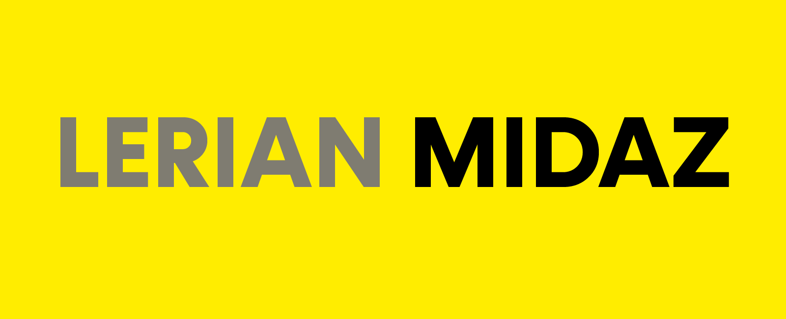

# Lerian Midaz: Enterprise-Grade Open-Source Ledger System

Lerian Midaz is a modern, open-source ledger system designed for building financial infrastructure that can scale from fintech startups to enterprise banking solutions. With a robust and flexible architecture, Midaz empowers developers to create sophisticated financial applications that can handle complex transactional requirements.

## Why Midaz?

- **Enterprise-Ready**: Built with the reliability, scalability, and security needed for mission-critical financial systems
- **Developer-Friendly**: Clean architecture and comprehensive API documentation for rapid integration and development
- **Future-Proof Design**: Multi-asset and multi-currency support to handle both traditional and digital assets in a single system
- **Community-Backed**: Growing open-source community with commercial support options available from Lerian

## Core Banking

At Lerian, we view a core banking system as a comprehensive platform consisting of four main components:

1. **Ledger**: The central database that manages all transactions and accounts. This is where Midaz plays a crucial role, serving as the foundation of the core banking system. We implemented our ledger with two main services:

   - **Onboarding Service**: Manages organizations, ledgers, assets, portfolios, segments, and accounts.
   - **Transaction Service**: Handles complex n:n transactions with double-entry accounting.
2. **Transactional Messaging Integrations**: These are responsible for integrating with external systems to generate debits and credits in the ledger. Examples include instant payments (like PIX in Brazil), card transactions, and wire transfers.
3. **Governance Integrations**: These are responsible for enhancing the core banking capabilities with KYC, anti-fraud/AML measures, management reporting, regulatory compliance, and accounting reporting.

Our open-source approach allows for the integration of Midaz with other components, like transactional messaging and governance, creating a complete core banking solution tailored to your specific needs. We also provide a marketplace with different plugins that streamline the integration of these messaging systems and governance players. These plugins are built by both Lerian and the community/partners.

If you are interested in contributing to the development of these plugins or have any questions, please feel free to reach out to us in the Discussions tab or at [contact@lerian.studio](mailto:contact@lerian.studio).

We will also provide soon a list of potential new plugins that could be built, to help you get started. More to come!

## Core Architecture

Lerian Midaz is built as a modern, cloud-native platform with a modular microservices architecture:

### Domains

Lerian Midaz implements a comprehensive financial hierarchy:

- **Organizations**: Top-level entities, optionally with parent-child relationships
- **Ledgers**: Financial record-keeping systems belonging to organizations
- **Assets**: Different types of value (currencies, securities, etc.) with specific codes
- **Portfolios**: Collections of accounts for organizational purposes
- **Segments**: Categories for grouping accounts (e.g., by department, product line)
- **Accounts**: Basic units for tracking financial resources, linked to assets with specific types
- **Transactions**: Financial transactions with debits and credits
- **Balances**: Account balance tracking with available funds management and transaction capabilities

### Services

1. **Onboarding Service**: Core entity management system.

   - Implements hexagonal architecture with CQRS pattern
   - RESTful API with OpenAPI documentation
   - PostgreSQL for primary data, MongoDB for flexible metadata
   - Manages the full financial hierarchy from organizations to accounts
2. **Transaction Service**: Financial transaction processing system.

   - Handles complex n:n transactions with double-entry accounting
   - Supports multiple transaction creation methods (JSON, DSL, templates)
   - Asset rate management and balance tracking with optimistic concurrency
   - Event-driven architecture using RabbitMQ for transaction lifecycle
3. **Infrastructure Layer**: Containerized infrastructure services.

   - PostgreSQL with primary-replica setup for high availability
   - MongoDB replica set for metadata storage
   - RabbitMQ for message queuing with predefined exchanges
   - Valkey for caching and message passing
   - Grafana/OpenTelemetry for comprehensive monitoring

### Transaction Processing

Lerian Midaz implements true double-entry accounting with sophisticated transaction capabilities:

- **Double-Entry Engine**: Every credit has a corresponding debit, ensuring financial integrity
- **Multi-Asset Support**: Handle transactions across different currencies with automatic rate conversion
- **Complex Transactions**: Support for n:n operations (multiple sources to multiple destinations)
- **Domain-Specific Language**: Proprietary DSL for modeling complex transactions
- **Immutable Records**: Every transaction is permanently recorded for audit purposes
- **Async Processing**: Event-driven architecture for scalable transaction handling
- **Balance Management**: Sophisticated balance tracking with available and on-hold amounts

### Technical Highlights

- **Hexagonal Architecture**: Clear separation between domain logic and external dependencies
- **CQRS Pattern**: Separate command and query responsibilities for optimized performance
- **Event-Driven Design**: Asynchronous processing using message queues for scalability
- **Domain-Specific Language**: Specialized grammar for defining complex transactions
- **Optimistic Concurrency**: Version-based concurrency control for balance updates
- **Comprehensive APIs**: RESTful endpoints with OpenAPI documentation
- **Testing**: Extensive unit and integration tests with mocking support

## Getting Started

To start using Lerian Midaz, please follow our [Getting Started Guide](https://docs.lerian.studio/docs/getting-started). For comprehensive documentation on Midaz features, API references, and best practices, visit our [Official Documentation](https://docs.lerian.studio).

## Community & Support

- Join our [Discord community](https://discord.gg/DnhqKwkGv3) for discussions, support, and updates.
- For bug reports and feature requests, please use our [GitHub Issues](https://github.com/LerianStudio/midaz/v3/issues).
- If you want to raise anything to the attention of the community, open a Discussion in our [GitHub](https://github.com/LerianStudio/midaz/v3/discussions).
- Follow us on [Twitter](https://twitter.com/LerianStudio) for the latest news and announcements.

## Repo Activity

## Contributing & License

We welcome contributions from the community! Please read our [Contributing Guidelines](CONTRIBUTING.md) to get started. Lerian Midaz is released under the Apache License 2.0. See [LICENSE](LICENSE) for more information. In a nutshell, this means you can use, modify, and distribute Midaz as you see fit, as long as you include the original copyright and license notice.

## About Lerian

Midaz is developed by Lerian, a tech company founded in 2024, led by a team with a track record in developing ledger and core banking solutions. For any inquiries or support, please reach out to us at [contact@lerian.studio](mailto:contact@lerian.studio) or simply open a Discussion in our [GitHub repository](https://github.com/LerianStudio/midaz/v3/discussions).
