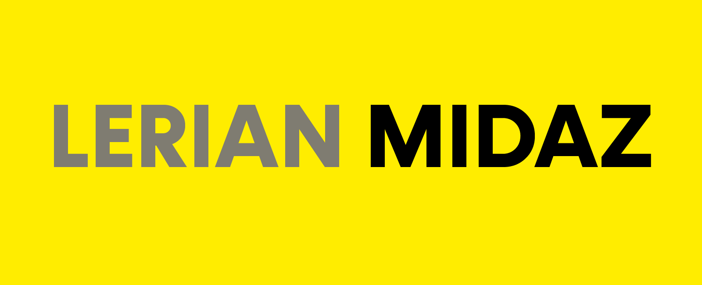

<div align="center">

[](https://github.com/LerianStudio/midaz-console/releases)
[](https://github.com/LerianStudio/midaz-console/blob/ESLintReport)
[](https://discord.gg/DnhqKwkGv3)

</div>

## Midaz Console: Simplify Management of Your Next-Gen Open-Source Ledger

Midaz Console is a comprehensive solution for managing your Midaz open-source ledger. With the Console, you can efficiently oversee and handle all operations related to Midaz through an intuitive interface.

The Midaz Open-Source Ledger offers flexible management options via APIs, gRPC, and CLI. Midaz Console is purpose-built to simplify user operations and streamline routine tasks on the Midaz platform.

## Getting Started

To start using Midaz Console, you'll need a running instance of the Midaz Open-Source Ledger. Please follow our [Getting Started Guide](https://docs.lerian.studio/docs/getting-started) for the [Midaz Open-Source Ledger](https://github.com/LerianStudio/midaz) . For a complete overview of Midaz features, API references, and best practices, visit our [Official Documentation](https://docs.lerian.studio/).

### Prerequisites

- [Midaz Open-Source Ledger](https://github.com/LerianStudio/midaz) 
- Node.js (Version: >=18.x)
- npm
- Docker: [Docker Installation](https://docs.docker.com/get-docker/)
- Docker Compose: [Docker Compose Installation](https://docs.docker.com/compose/install/)

## Node.js Version Management

This project uses Node.js LTS versions and includes automatic version management:

- An `.nvmrc` file specifies the LTS version requirement
- The `check-node-version.sh` script automatically checks and updates your Node.js version
- A preinstall hook runs this check before `npm install`

To ensure proper setup:

1. Install [NVM (Node Version Manager)](https://github.com/nvm-sh/nvm)
2. When you run `npm install`, the script will automatically check your Node version
3. If needed, it will install the latest LTS version and prompt you to run `nvm use --lts`

These checks help maintain consistent Node.js environments across development and prevent version-related issues.

## Running the Application Locally

:warning: **Note:** Ensure that the [Midaz Open-Source Ledger](https://github.com/LerianStudio/midaz) environment is active and accessible, then follow these steps:

1. Clone the Midaz Console repository:

```bash
git clone https://github.com/LerianStudio/midaz-console.git
```

2. Run the following commands to configure and start the local console stack:

```bash
npm install
npm run set-local-env
npm run dev
```

3. Open http://localhost:8081 in your browser to verify that Midaz Console is running.

## Deploying with Docker

To deploy Midaz Console in a Docker environment, execute the following npm script:

```bash
npm run docker-up
```

## Community & Support

- Join our [Discord community](https://discord.gg/DnhqKwkGv3) for discussions, support, and updates.
- For bug reports and feature requests, please use our [GitHub Issues](https://github.com/LerianStudio/midaz-console/issues).
- To share ideas or discuss topics with the community, start a Discussion on our [GitHub](https://github.com/LerianStudio/midaz-console/discussions).
- Follow us on [Twitter](https://twitter.com/LerianStudio) for news and announcements.

## Repo Activity


## Contributing & License

We welcome contributions from the community! Please read our [Contributing Guidelines](CONTRIBUTING.md) to get started.

Midaz is released under the Apache License 2.0. See the [LICENSE](LICENSE.md) for more details. This license allows you to use, modify, and distribute Midaz, provided you include the original copyright and license.

## About Lerian

Midaz is developed by Lerian, a technology company founded in 2023 by a team with extensive experience in ledger and core banking solutions. For inquiries or support, contact us at [contact@lerian.io](mailto:contact@lerian.io) or start a Discussion in our [GitHub repository](https://github.com/LerianStudio/midaz-console/discussions).
