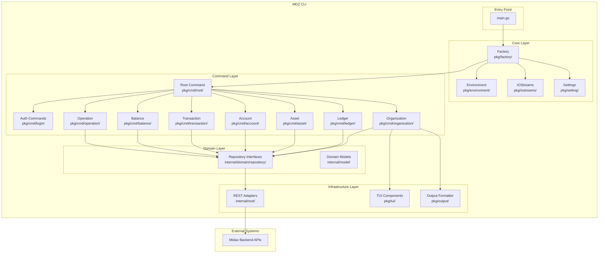
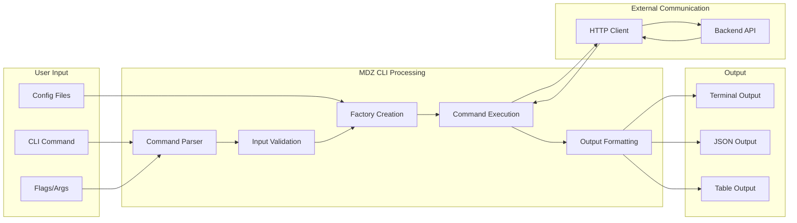
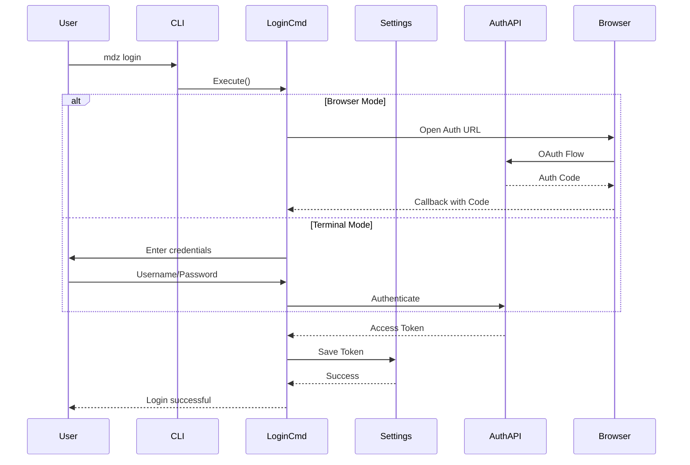
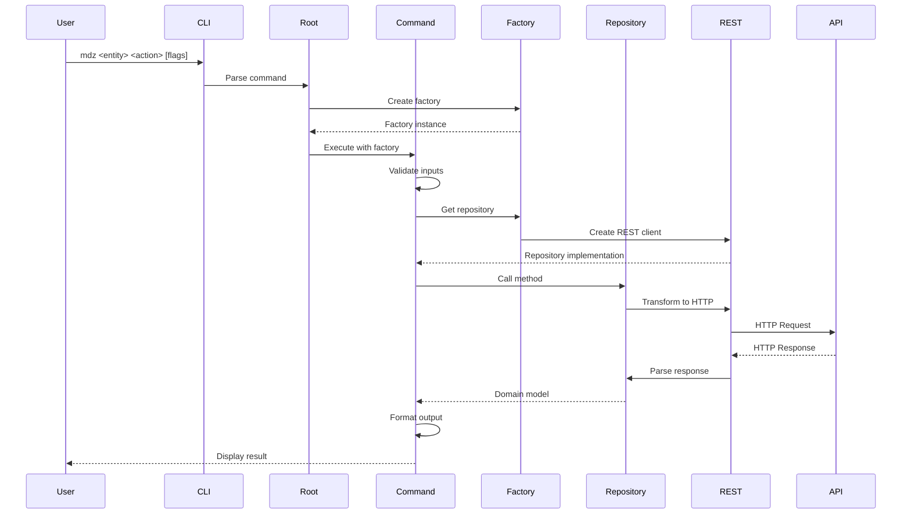
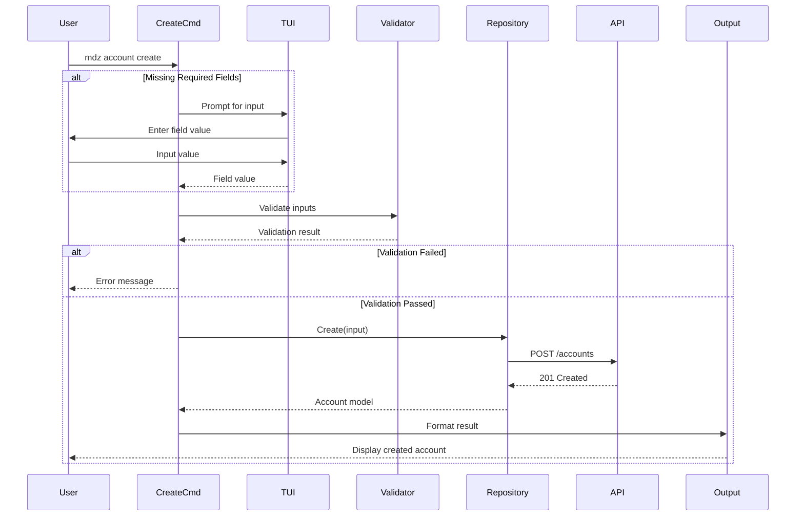

# MDZ CLI Architecture Documentation

## Table of Contents
- [Executive Summary](#executive-summary)
- [System Architecture](#system-architecture)
  - [Component Diagram](#component-diagram)
  - [Data Flow Diagram](#data-flow-diagram)
- [Component Breakdown](#component-breakdown)
  - [Core Components](#core-components)
  - [Command Structure](#command-structure)
  - [Repository Layer](#repository-layer)
  - [REST Adapters](#rest-adapters)
- [Sequence Diagrams](#sequence-diagrams)
  - [Authentication Flow](#authentication-flow)
  - [Command Execution Flow](#command-execution-flow)
  - [CRUD Operation Flow](#crud-operation-flow)
- [API Interfaces](#api-interfaces)
  - [Internal APIs](#internal-apis)
  - [External REST APIs](#external-rest-apis)
- [Data Models](#data-models)
- [Design Decisions](#design-decisions)
- [Notable Implementation Patterns](#notable-implementation-patterns)
- [Potential Improvement Areas](#potential-improvement-areas)

## Executive Summary

MDZ (Midaz CLI) is a command-line interface tool designed to interact with the Midaz ledger system. It follows a clean architecture pattern with clear separation of concerns, leveraging the Factory pattern for dependency injection and the Command pattern via Cobra for CLI structure. The architecture emphasizes testability, extensibility, and maintainability through interface-based design and consistent patterns across all domain entities.

## System Architecture

### Component Diagram



### Data Flow Diagram



## Component Breakdown

### Core Components

#### 1. Main Entry Point (`main.go`)
- **Purpose**: Bootstrap the application
- **Responsibilities**:
  - Initialize environment configuration
  - Create factory instance
  - Execute root command
  - Handle fatal errors

#### 2. Factory (`pkg/factory/factory.go`)
- **Purpose**: Central dependency container
- **Key Components**:
  ```go
  type Factory struct {
      HTTPClient  *http.Client
      IOStreams   iostreams.IOStreams
      Config      *Config
      Environment environment.Env
      Token       string
  }
  ```
- **Responsibilities**:
  - Provide dependencies to all commands
  - Manage HTTP client configuration
  - Handle authentication token

#### 3. Environment (`pkg/environment/environment.go`)
- **Purpose**: Manage build-time and runtime configuration
- **Key Fields**:
  - `Version`: CLI version
  - `GitCommit`: Build commit hash
  - `Date`: Build date
  - `APIAddress`: Backend API URL
  - `AuthURL`: Authentication service URL

#### 4. IOStreams (`pkg/iostreams/iostreams.go`)
- **Purpose**: Abstract input/output operations
- **Components**:
  - `In`: Input reader
  - `Out`: Output writer
  - `Err`: Error writer
  - `EnableColor`: Color output control

### Command Structure

Each domain entity follows a consistent command pattern:

#### Standard Commands per Entity:
1. **Create** - Create new resource
2. **List** - List all resources
3. **Describe** - Get detailed information
4. **Update** - Update existing resource
5. **Delete** - Remove resource

#### Command Organization (`pkg/cmd/`):
```
cmd/
├── root/          # Root command orchestration
├── login/         # Authentication commands
├── configure/     # Configuration management
├── organization/  # Organization CRUD
├── ledger/        # Ledger CRUD
├── asset/         # Asset CRUD
├── portfolio/     # Portfolio CRUD
├── segment/       # Segment CRUD
├── account/       # Account CRUD
├── transaction/   # Transaction operations
├── operation/     # Operation queries
├── balance/       # Balance queries
├── asset_rate/    # Asset rate management
└── version/       # Version information
```

### Repository Layer

#### Repository Interfaces (`internal/domain/repository/`)
Each domain entity has a repository interface defining the contract:

```go
// Example: Account Repository
type Account interface {
    Create(context.Context, string, string, CreateAccountInput) (*mmodel.Account, error)
    Get(context.Context, string, string, QueryPagination) (*mmodel.Accounts, error)
    GetByID(context.Context, string, string, string) (*mmodel.Account, error)
    Update(context.Context, string, string, string, UpdateAccountInput) (*mmodel.Account, error)
    Delete(context.Context, string, string, string) error
}
```

### REST Adapters

#### REST Implementation (`internal/rest/`)
- Implements repository interfaces
- Handles HTTP communication
- Manages request/response serialization
- Error handling and status code mapping

## Sequence Diagrams

### Authentication Flow



### Command Execution Flow



### CRUD Operation Flow



## API Interfaces

### Internal APIs

#### Repository Interfaces
All repository interfaces follow a consistent pattern located in `internal/domain/repository/`:

1. **Organization** (`organization.go`)
   - `Create()`, `Get()`, `GetByID()`, `Update()`, `Delete()`

2. **Ledger** (`ledger.go`)
   - `Create()`, `Get()`, `GetByID()`, `Update()`, `Delete()`

3. **Asset** (`asset.go`)
   - `Create()`, `Get()`, `GetByID()`, `Update()`, `Delete()`

4. **Account** (`account.go`)
   - `Create()`, `Get()`, `GetByID()`, `Update()`, `Delete()`

5. **Transaction** (`transaction.go`)
   - `Create()`, `CreateFromDSL()`, `Get()`, `GetByID()`, `Revert()`

6. **Balance** (`balance.go`)
   - `Get()`, `GetByID()`, `GetByAccount()`, `Delete()`

7. **Operation** (`operation.go`)
   - `Get()`, `GetByID()`, `GetByAccount()`

### External REST APIs

The CLI communicates with the following backend API endpoints:

#### Authentication Endpoints
- `POST /v1/auth/authenticate` - Authenticate user
- `POST /v1/auth/token` - Exchange auth code for token

#### Organization Endpoints
- `GET /v1/organizations` - List organizations
- `POST /v1/organizations` - Create organization
- `GET /v1/organizations/{id}` - Get organization by ID
- `PATCH /v1/organizations/{id}` - Update organization
- `DELETE /v1/organizations/{id}` - Delete organization

#### Ledger Endpoints
- `GET /v1/organizations/{orgId}/ledgers` - List ledgers
- `POST /v1/organizations/{orgId}/ledgers` - Create ledger
- `GET /v1/organizations/{orgId}/ledgers/{id}` - Get ledger
- `PATCH /v1/organizations/{orgId}/ledgers/{id}` - Update ledger
- `DELETE /v1/organizations/{orgId}/ledgers/{id}` - Delete ledger

#### Asset Endpoints
- `GET /v1/organizations/{orgId}/ledgers/{ledgerId}/assets` - List assets
- `POST /v1/organizations/{orgId}/ledgers/{ledgerId}/assets` - Create asset
- `GET /v1/organizations/{orgId}/ledgers/{ledgerId}/assets/{id}` - Get asset
- `PATCH /v1/organizations/{orgId}/ledgers/{ledgerId}/assets/{id}` - Update asset
- `DELETE /v1/organizations/{orgId}/ledgers/{ledgerId}/assets/{id}` - Delete asset

#### Account Endpoints
- `GET /v1/organizations/{orgId}/ledgers/{ledgerId}/accounts` - List accounts
- `POST /v1/organizations/{orgId}/ledgers/{ledgerId}/accounts` - Create account
- `GET /v1/organizations/{orgId}/ledgers/{ledgerId}/accounts/{id}` - Get account
- `PATCH /v1/organizations/{orgId}/ledgers/{ledgerId}/accounts/{id}` - Update account
- `DELETE /v1/organizations/{orgId}/ledgers/{ledgerId}/accounts/{id}` - Delete account

#### Transaction Endpoints
- `GET /v1/organizations/{orgId}/ledgers/{ledgerId}/transactions` - List transactions
- `POST /v1/organizations/{orgId}/ledgers/{ledgerId}/transactions` - Create transaction
- `POST /v1/organizations/{orgId}/ledgers/{ledgerId}/transactions/dsl` - Create from DSL
- `GET /v1/organizations/{orgId}/ledgers/{ledgerId}/transactions/{id}` - Get transaction
- `POST /v1/organizations/{orgId}/ledgers/{ledgerId}/transactions/{id}/revert` - Revert transaction

#### Balance Endpoints
- `GET /v1/organizations/{orgId}/ledgers/{ledgerId}/balances` - List balances
- `GET /v1/organizations/{orgId}/ledgers/{ledgerId}/balances/{id}` - Get balance
- `GET /v1/organizations/{orgId}/ledgers/{ledgerId}/accounts/{accountId}/balances` - Get account balances
- `DELETE /v1/organizations/{orgId}/ledgers/{ledgerId}/balances/{id}` - Delete balance

#### Operation Endpoints
- `GET /v1/organizations/{orgId}/ledgers/{ledgerId}/operations` - List operations
- `GET /v1/organizations/{orgId}/ledgers/{ledgerId}/operations/{id}` - Get operation
- `GET /v1/organizations/{orgId}/ledgers/{ledgerId}/accounts/{accountId}/operations` - Get account operations

## Data Models

The CLI uses models from the shared `pkg/mmodel` package. Key models include:

### Core Entities
- **Organization**: Root entity for multi-tenancy
- **Ledger**: Container for accounts and transactions
- **Asset**: Currency or asset definitions
- **Portfolio**: Groups of accounts
- **Segment**: Account categorization
- **Account**: Individual account in the ledger
- **Transaction**: Double-entry bookkeeping transaction
- **Operation**: Individual debit/credit operation
- **Balance**: Account balance snapshot

### Authentication Models
- **Credentials**: Username/password for authentication
- **Token**: Access token response

## Design Decisions

### 1. Factory Pattern for Dependency Injection
- **Rationale**: Provides clean dependency management without global state
- **Benefits**: Testability, flexibility, clear dependencies

### 2. Interface-Based Repository Pattern
- **Rationale**: Decouple business logic from infrastructure
- **Benefits**: Easy mocking, swappable implementations

### 3. Cobra Command Framework
- **Rationale**: Industry-standard CLI framework
- **Benefits**: Consistent UX, built-in help, flag parsing

### 4. Structured Error Handling
- **Rationale**: Consistent error reporting across commands
- **Benefits**: Better debugging, user-friendly messages

### 5. TUI for Interactive Input
- **Rationale**: Guide users through complex inputs
- **Benefits**: Better UX for missing required fields

## Notable Implementation Patterns

### 1. Command Factory Pattern
Each command has its own factory struct that encapsulates:
- Repository dependencies
- Flags/configuration
- Execution logic

Example:
```go
type factoryAccountCreate struct {
    factory      *factory.Factory
    repoAccount  repository.Account
    tuiInput     func(string) (string, error)
    flagsCreate  // Embedded flags struct
}
```

### 2. Consistent Flag Structure
All CRUD commands follow the same flag pattern:
- Required: `--organization-id`, `--ledger-id`
- Optional: `--output` (json/table)
- Entity-specific flags

### 3. Output Formatting
Flexible output system supporting:
- Table format (default)
- JSON format (for scripting)
- Consistent formatting across all commands

### 4. Mock Generation
Comprehensive mocking support:
- Repository interfaces have corresponding mocks
- Used extensively in unit tests
- Generated with mockery tool

### 5. Golden File Testing
Output validation using golden files:
- Captures expected output
- Ensures consistency across changes
- Located in `testdata/` directories

## Recent Improvements

### 1. Enhanced Error Recovery (✅ Implemented)
- **Retry Logic**: Automatic retry with exponential backoff for transient failures
- **Better Error Messages**: Context-aware error messages with helpful suggestions
- **Rollback Support**: Transaction-style operations with automatic rollback on failure
- **Location**: `pkg/errors/` - Comprehensive error handling package

### 2. Interactive Mode (✅ Implemented)
- **REPL Interface**: Full interactive mode with `mdz interactive` command
- **Command History**: Persistent command history with readline support
- **Auto-completion**: Tab completion for commands, subcommands, and flags
- **Built-in Commands**: Special REPL commands (history, clear, pwd)
- **Location**: `pkg/repl/`, `pkg/cmd/interactive/`

### 3. Audit Trail (✅ Implemented)
- **Command History**: All commands logged with timestamp, duration, and result
- **Operation Logging**: Detailed audit trail stored in `~/.mdz/audit.json`
- **Undo/Redo**: Support for undoing create operations with `mdz undo`
- **History Viewer**: `mdz history` command to view and manage audit trail
- **Location**: `pkg/audit/`, `pkg/cmd/history/`, `pkg/cmd/undo/`

### 4. Type Safety Improvements (✅ Implemented)
- **Modern Go**: Replaced `interface{}` with `any` throughout the codebase
- **Enhanced Error Types**: Strongly typed error system with rich context
- **Type-safe Builders**: Fluent interfaces for building complex objects

## Remaining Improvement Areas

### 1. Offline Mode
- Cache frequently accessed data
- Queue operations for later sync
- Better handling of network failures

### 2. Plugin System
- Allow custom commands
- Extension points for enterprise features
- Dynamic command loading

### 3. Configuration Management
- Support for configuration profiles
- Environment-specific settings
- Secure credential storage

### 4. Performance Optimizations
- Parallel operations where applicable
- Response caching
- Lazy loading of command dependencies

### 5. Batch Operations
- Support for bulk operations
- Transaction batching
- CSV import/export

### 6. Observability
- Command execution metrics
- Performance profiling
- Debug mode with detailed logging

### 7. Advanced Undo/Redo
- State snapshots for update operations
- Undo stack with multiple levels
- Selective undo of specific operations

### 8. Command Aliases
- User-defined command shortcuts
- Persistent alias storage
- Alias expansion in interactive mode