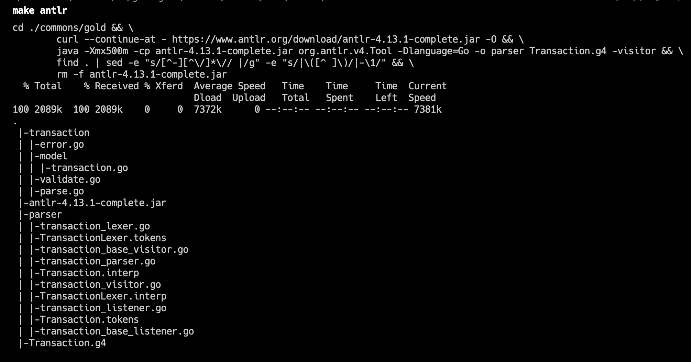
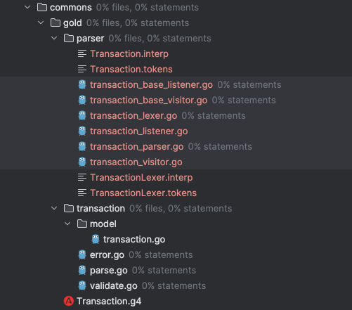
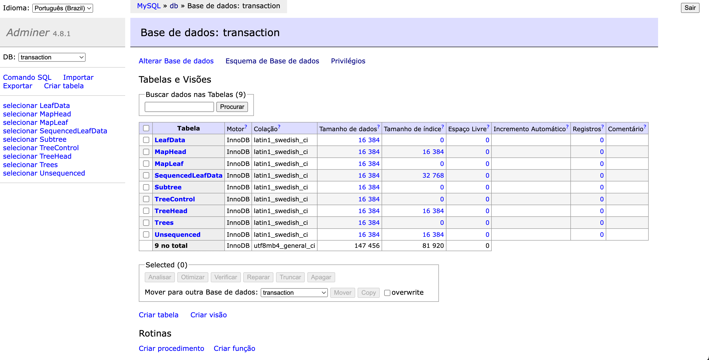
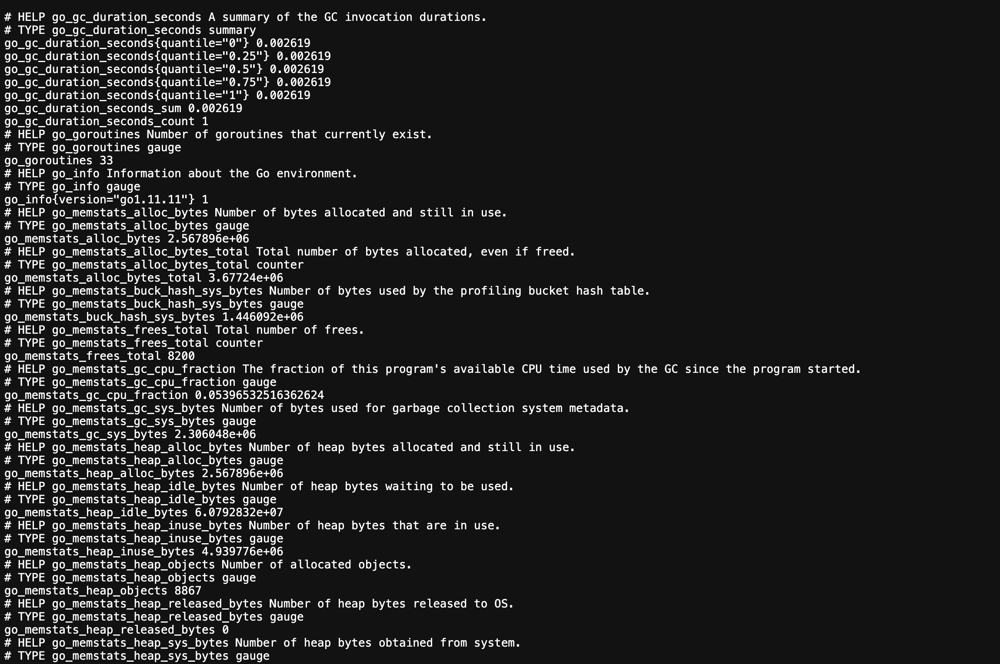

# ANTLR4 Generate Parser, lexers and Listeners

## make antlr :
```bash
make transaction COMMAND=\"up\"
```
### Example:


### Your project should look just like the example in the image below::



# Trillian Log Temper

## Adminer:

adminer is included purely to confirm that the database is established correctly. If you browse localhost:8080 after starting the services, you should be able to list the test database tables:
url : http://localhost:8080/

### Example:



## Metrics:

The Trillian services expose Prometheus metric endpoints. The log server’s http endpoint is :8091 and the log signer’s is on :8092. So, e.g.:
url : http://localhost:8091/metrics

### Example:
