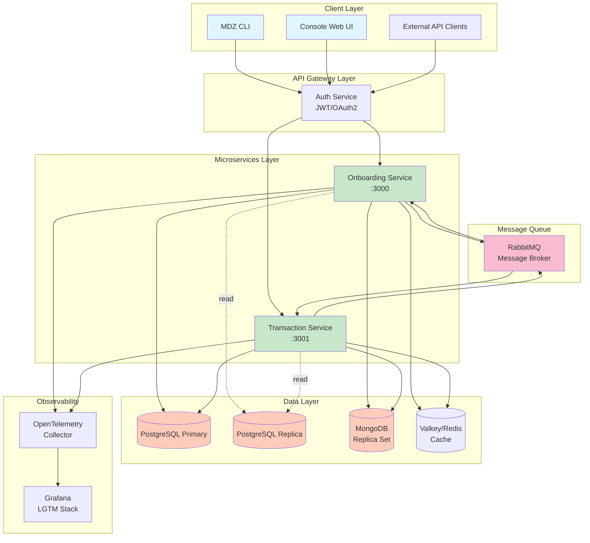
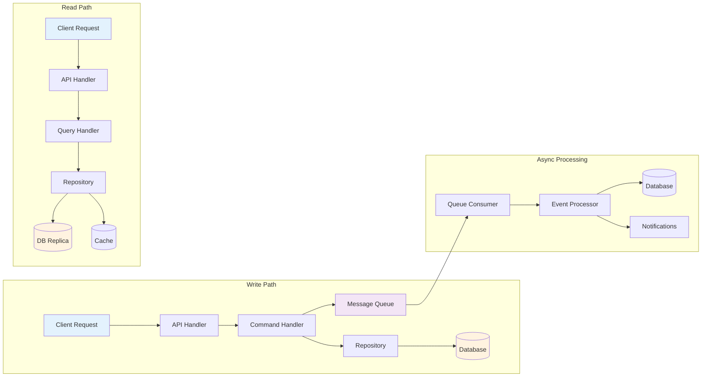
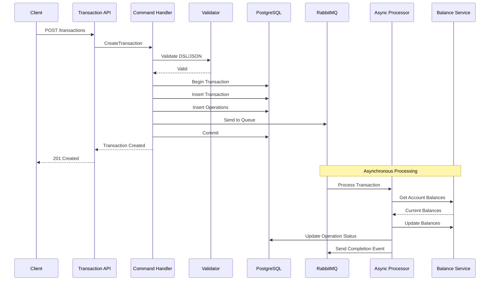
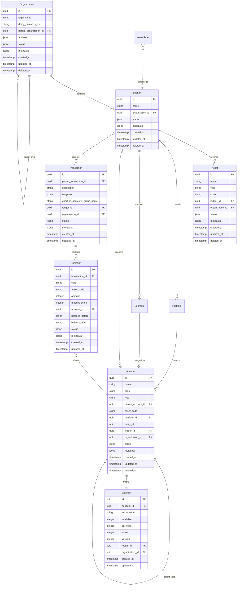

# Midaz Architecture Analysis

## Table of Contents
- [Executive Summary](#executive-summary)
- [System Overview](#system-overview)
- [Architecture Diagrams](#architecture-diagrams)
  - [System Component Diagram](#system-component-diagram)
  - [Data Flow Diagram](#data-flow-diagram)
  - [Transaction Processing Sequence](#transaction-processing-sequence)
- [Technology Stack](#technology-stack)
- [Component Breakdown](#component-breakdown)
  - [Onboarding Service](#onboarding-service)
  - [Transaction Service](#transaction-service)
  - [MDZ CLI](#mdz-cli)
  - [Console Web UI](#console-web-ui)
  - [Infrastructure Layer](#infrastructure-layer)
- [API Catalog](#api-catalog)
- [Data Model Architecture](#data-model-architecture)
- [Architectural Patterns](#architectural-patterns)
- [Key Design Decisions](#key-design-decisions)
- [Notable Implementation Patterns](#notable-implementation-patterns)
- [Security Architecture](#security-architecture)
- [Performance Optimizations](#performance-optimizations)
- [Potential Improvement Areas](#potential-improvement-areas)

## Executive Summary

Midaz is a modern, enterprise-grade open-source ledger system designed with a microservices architecture that emphasizes scalability, maintainability, and financial integrity. The system implements double-entry accounting with sophisticated transaction capabilities, multi-asset support, and a clean separation of concerns following Domain-Driven Design (DDD) and hexagonal architecture principles.

### Key Architectural Highlights
- **Microservices Architecture**: Independently deployable services for onboarding and transaction processing
- **Hexagonal Architecture**: Clear separation between business logic and infrastructure concerns
- **CQRS Pattern**: Optimized read/write operations with command/query separation
- **Event-Driven Processing**: Asynchronous transaction handling via RabbitMQ
- **Multi-Database Strategy**: PostgreSQL for transactional data, MongoDB for flexible metadata
- **Domain-Specific Language**: Custom DSL for complex transaction modeling
- **Comprehensive Observability**: Built-in OpenTelemetry integration for monitoring

## System Overview

Midaz consists of four main components working together to provide a complete ledger solution:

1. **Onboarding Service**: Manages the financial hierarchy (organizations, ledgers, assets, accounts)
2. **Transaction Service**: Handles financial transactions with double-entry accounting
3. **MDZ CLI**: Command-line interface for system administration
4. **Console Web UI**: Modern web interface for end-users

## Architecture Diagrams

### System Component Diagram



### Data Flow Diagram



### Transaction Processing Sequence



## Technology Stack

### Core Technologies
- **Language**: Go 1.23.2
- **Web Framework**: Fiber v2 (Onboarding/Transaction), Next.js 14 (Console)
- **Databases**: PostgreSQL 16, MongoDB 7, Valkey (Redis fork)
- **Message Queue**: RabbitMQ 4.0
- **Observability**: OpenTelemetry, Grafana LGTM
- **Authentication**: JWT/OAuth2 (lib-auth), NextAuth.js
- **API Documentation**: OpenAPI 3.0.1, Swagger

### Key Libraries
- **Database**: 
  - `jackc/pgx/v5` - PostgreSQL driver
  - `Masterminds/squirrel` - SQL query builder
  - `go.mongodb.org/mongo-driver` - MongoDB driver
- **Validation**: `go-playground/validator`
- **CLI**: `spf13/cobra`, `charmbracelet/bubbletea`
- **Testing**: `stretchr/testify`, `DATA-DOG/go-sqlmock`
- **DSL Parser**: ANTLR4 for transaction grammar

## Component Breakdown

### Onboarding Service

**Location**: `components/onboarding/`

**Purpose**: Manages the core financial entities and their relationships

**Architecture**:
- **Hexagonal Architecture** with clear ports and adapters
- **CQRS Pattern** separating commands and queries
- **Repository Pattern** for data access abstraction

**Key Components**:
- **HTTP Adapters** (`internal/adapters/http/`): RESTful API endpoints
- **Command Handlers** (`internal/services/command/`): 
  - Create/Update/Delete for all entities
  - Metadata management
  - Queue integration for async operations
- **Query Handlers** (`internal/services/query/`):
  - Get by ID, List with pagination
  - Metadata queries
  - Alias resolution
- **Database Adapters**:
  - PostgreSQL: Primary data storage with repositories for each entity
  - MongoDB: Flexible metadata storage
- **Message Queue**: RabbitMQ producer for account events

**Entities Managed**:
- Organizations (with hierarchical support)
- Ledgers
- Assets (currencies, securities)
- Portfolios (account groupings)
- Segments (logical divisions)
- Accounts (with aliases and hierarchy)

### Transaction Service

**Location**: `components/transaction/`

**Purpose**: Handles all financial transactions with double-entry accounting

**Architecture**:
- Similar hexagonal architecture as Onboarding
- Event-driven transaction processing
- Optimistic concurrency control for balances

**Key Components**:
- **Command Handlers**:
  - Transaction creation (JSON, DSL, templates)
  - Balance management (create, update, delete)
  - Operation processing
  - Asset rate management
- **Query Handlers**:
  - Transaction history with filtering
  - Balance inquiries
  - Operation tracking
- **Queue Integration**:
  - Consumer for account creation events
  - Producer for transaction events
  - Async balance calculation
- **DSL Parser**: ANTLR4-based parser for transaction DSL

**Transaction Features**:
- N:N transaction support (multiple sources to multiple destinations)
- Automatic currency conversion with asset rates
- Pending transaction support
- Transaction templates
- Immutable audit trail

### MDZ CLI

**Location**: `components/mdz/`

**Purpose**: Command-line interface for system administration

**Architecture**:
- Command pattern using Cobra framework
- Factory pattern for dependency injection
- Repository pattern for API interactions

**Key Features**:
- **Authentication**: Browser-based or terminal login
- **Resource Management**: Full CRUD for all entities
- **Interactive Mode**: TUI components for missing inputs
- **Batch Operations**: JSON file input support
- **Configuration**: TOML-based config in `~/.config/mdz/`

**Commands Structure**:
```
mdz
├── login
├── configure
├── version
├── organization (create, list, describe, update, delete)
├── ledger (create, list, describe, update, delete)
├── asset (create, list, describe, update, delete)
├── portfolio (create, list, describe, update, delete)
├── segment (create, list, describe, update, delete)
└── account (create, list, describe, update, delete)
```

### Console Web UI

**Location**: `components/console/`

**Purpose**: Modern web interface for end-users

**Architecture**:
- **Clean Architecture** with DDD principles
- **Hexagonal Architecture** separation
- **Dependency Injection** using InversifyJS

**Tech Stack**:
- Next.js 14 with App Router
- React 18 with TypeScript
- TanStack Query for server state
- Tailwind CSS for styling
- React Hook Form + Zod for forms
- NextAuth.js for authentication

**Key Features**:
- Multi-tenant with organization switching
- Permission-based access control
- Real-time data updates
- Internationalization (en, pt)
- Dark mode support
- Comprehensive component library

**Directory Structure**:
```
src/
├── app/             # Next.js app router
├── core/
│   ├── domain/      # Entities, repository interfaces
│   ├── application/ # Use cases, DTOs, mappers
│   └── infrastructure/ # Repository implementations
├── components/      # UI components
├── hooks/          # Custom React hooks
├── client/         # API client services
└── schema/         # Zod validation schemas
```

### Infrastructure Layer

**Location**: `components/infra/`

**Purpose**: Container orchestration and supporting services

**Services**:
1. **PostgreSQL** (Primary + Replica)
   - Logical replication for read scaling
   - Separate databases per service
   - Connection pooling configuration

2. **MongoDB Replica Set**
   - Metadata storage
   - Flexible schema for custom fields

3. **Valkey (Redis)**
   - Session management
   - Caching layer
   - Message passing

4. **RabbitMQ**
   - Event-driven architecture
   - Queue definitions for different workflows
   - Separate users per service

5. **Grafana OTEL-LGTM**
   - Metrics, logs, and traces
   - OpenTelemetry collector
   - Pre-configured dashboards

## API Catalog

### Onboarding Service APIs (Port 3000)

**Base Path**: `/v1`

**Organization Endpoints**:
- `GET /organizations` - List organizations with pagination
- `POST /organizations` - Create organization
- `GET /organizations/{id}` - Get organization by ID
- `PATCH /organizations/{id}` - Update organization
- `DELETE /organizations/{id}` - Delete organization

**Ledger Endpoints**:
- `GET /organizations/{org_id}/ledgers` - List ledgers
- `POST /organizations/{org_id}/ledgers` - Create ledger
- `GET /organizations/{org_id}/ledgers/{id}` - Get ledger
- `PATCH /organizations/{org_id}/ledgers/{id}` - Update ledger
- `DELETE /organizations/{org_id}/ledgers/{id}` - Delete ledger

**Asset Endpoints**:
- `GET /organizations/{org_id}/ledgers/{ledger_id}/assets` - List assets
- `POST /organizations/{org_id}/ledgers/{ledger_id}/assets` - Create asset
- `GET /organizations/{org_id}/ledgers/{ledger_id}/assets/{id}` - Get asset
- `PATCH /organizations/{org_id}/ledgers/{ledger_id}/assets/{id}` - Update asset
- `DELETE /organizations/{org_id}/ledgers/{ledger_id}/assets/{id}` - Delete asset

**Portfolio Endpoints**:
- `GET /organizations/{org_id}/ledgers/{ledger_id}/portfolios` - List portfolios
- `POST /organizations/{org_id}/ledgers/{ledger_id}/portfolios` - Create portfolio
- `GET /organizations/{org_id}/ledgers/{ledger_id}/portfolios/{id}` - Get portfolio
- `PATCH /organizations/{org_id}/ledgers/{ledger_id}/portfolios/{id}` - Update portfolio
- `DELETE /organizations/{org_id}/ledgers/{ledger_id}/portfolios/{id}` - Delete portfolio

**Account Endpoints**:
- `GET /organizations/{org_id}/ledgers/{ledger_id}/accounts` - List accounts
- `POST /organizations/{org_id}/ledgers/{ledger_id}/accounts` - Create account
- `GET /organizations/{org_id}/ledgers/{ledger_id}/accounts/{id}` - Get account
- `GET /organizations/{org_id}/ledgers/{ledger_id}/accounts/alias/{alias}` - Get by alias
- `PATCH /organizations/{org_id}/ledgers/{ledger_id}/accounts/{id}` - Update account
- `DELETE /organizations/{org_id}/ledgers/{ledger_id}/accounts/{id}` - Delete account

### Transaction Service APIs (Port 3001)

**Base Path**: `/v1`

**Transaction Endpoints**:
- `GET /organizations/{org_id}/ledgers/{ledger_id}/transactions` - List transactions
- `POST /organizations/{org_id}/ledgers/{ledger_id}/transactions` - Create transaction
- `POST /organizations/{org_id}/ledgers/{ledger_id}/transactions/dsl` - Create via DSL
- `POST /organizations/{org_id}/ledgers/{ledger_id}/transactions/template` - Create from template
- `GET /organizations/{org_id}/ledgers/{ledger_id}/transactions/{id}` - Get transaction
- `PATCH /organizations/{org_id}/ledgers/{ledger_id}/transactions/{id}` - Update transaction

**Balance Endpoints**:
- `GET /organizations/{org_id}/ledgers/{ledger_id}/balances` - List all balances
- `GET /organizations/{org_id}/ledgers/{ledger_id}/accounts/{account_id}/balances` - Account balances
- `GET /organizations/{org_id}/ledgers/{ledger_id}/accounts/alias/{alias}/balances` - Balances by alias

**Operation Endpoints**:
- `GET /organizations/{org_id}/ledgers/{ledger_id}/operations` - List operations
- `GET /organizations/{org_id}/ledgers/{ledger_id}/operations/{id}` - Get operation
- `GET /organizations/{org_id}/ledgers/{ledger_id}/accounts/{account_id}/operations` - Account operations

**Asset Rate Endpoints**:
- `GET /organizations/{org_id}/ledgers/{ledger_id}/asset-rates/{asset_code}` - Get rates for asset

### Common Features Across APIs

**Authentication**: 
- Bearer token required in `Authorization` header
- JWT tokens with organization/user claims

**Request Tracking**:
- Optional `X-Request-Id` header for tracing

**Pagination**:
- `limit` and `page` query parameters
- Maximum 100 items per page

**Filtering**:
- Metadata filtering via JSON query parameter
- Date range filtering with `start_date` and `end_date`
- Sort order control with `sort_order`

**Error Responses**:
- Consistent error format with code and message
- HTTP status codes following REST conventions

## Data Model Architecture

### Entity Hierarchy



### Key Design Principles

1. **UUID v7 Identifiers**: Time-ordered UUIDs for all entities
2. **Soft Deletes**: `deleted_at` timestamp instead of hard deletes
3. **Metadata Support**: JSONB columns for extensibility
4. **Status Tracking**: Structured status objects with codes
4. **Audit Trail**: Created/updated timestamps on all records
5. **Hierarchical Support**: Organizations and Accounts can have parents
6. **Monetary Precision**: Integer amounts with scale for exact calculations

## Architectural Patterns

### 1. Hexagonal Architecture (Ports & Adapters)

**Implementation**:
```
internal/
├── adapters/       # External interfaces (ports)
│   ├── http/      # REST API
│   ├── postgres/  # Database
│   ├── mongodb/   # NoSQL storage
│   └── rabbitmq/  # Message queue
├── services/      # Business logic (application)
│   ├── command/   # Write operations
│   └── query/     # Read operations
└── bootstrap/     # Dependency injection
```

**Benefits**:
- Business logic isolated from infrastructure
- Easy to test with mock adapters
- Flexible to change external dependencies

### 2. CQRS (Command Query Responsibility Segregation)

**Command Side**:
- Handles writes through command handlers
- Validates business rules
- Emits events to message queue
- Uses primary database

**Query Side**:
- Optimized read models
- Can use read replicas
- Caching layer integration
- No business logic

### 3. Domain-Driven Design (DDD)

**Bounded Contexts**:
- Onboarding: Organization/Ledger management
- Transaction: Financial operations
- Console: User interface concerns

**Aggregates**:
- Organization (with Ledgers)
- Account (with Balance)
- Transaction (with Operations)

**Value Objects**:
- Status
- Address
- Metadata

### 4. Event-Driven Architecture

**Event Flow**:
1. Commands produce events to RabbitMQ
2. Consumers process events asynchronously
3. Events trigger downstream actions
4. Eventual consistency between services

**Key Events**:
- AccountCreated
- TransactionCreated
- BalanceUpdated

### 5. Repository Pattern

**Interface Definition**:
```go
type AccountRepository interface {
    Create(ctx context.Context, account *Account) error
    Find(ctx context.Context, id uuid.UUID) (*Account, error)
    List(ctx context.Context, filter Filter) ([]*Account, error)
    Update(ctx context.Context, account *Account) error
    Delete(ctx context.Context, id uuid.UUID) error
}
```

**Benefits**:
- Abstracts data access logic
- Enables testing with mocks
- Supports multiple implementations

## Key Design Decisions

### 1. Multi-Database Strategy

**Decision**: Use PostgreSQL for transactional data, MongoDB for metadata

**Rationale**:
- PostgreSQL: ACID compliance for financial data
- MongoDB: Flexibility for custom metadata fields
- Separation allows independent scaling

### 2. Microservices vs Monolith

**Decision**: Microservices architecture with clear service boundaries

**Rationale**:
- Independent scaling of services
- Team autonomy
- Technology flexibility per service
- Fault isolation

### 3. Synchronous vs Asynchronous Processing

**Decision**: Hybrid approach - sync for critical paths, async for heavy operations

**Rationale**:
- Immediate feedback for transaction creation
- Async balance calculation for performance
- Event-driven integration between services

### 4. Custom DSL for Transactions

**Decision**: ANTLR4-based DSL for complex transaction modeling

**Rationale**:
- Express complex financial operations clearly
- Type-safe transaction definitions
- Reusable transaction templates
- Domain expert friendly

### 5. Integer-based Monetary Representation

**Decision**: Store amounts as integers with scale

**Rationale**:
- Avoid floating-point precision issues
- Exact calculations required for finance
- Standard practice in financial systems

## Notable Implementation Patterns

### 1. Optimistic Concurrency Control

**Implementation**: Version field on Balance entity

```go
type Balance struct {
    ID        uuid.UUID
    AccountID uuid.UUID
    Available int64
    OnHold    int64
    Version   int32  // Incremented on each update
}
```

**Usage**: Prevents lost updates in concurrent balance modifications

### 2. Command Handler Pattern

**Structure**:
```go
type CreateAccountUseCase struct {
    Repo            AccountRepository
    MetadataRepo    MetadataRepository
    LedgerRepo      LedgerRepository
    AccountQueueProducer *rabbitmq.Producer
}

func (uc *CreateAccountUseCase) Execute(ctx context.Context, cmd CreateAccountCommand) (*Account, error) {
    // Validation
    // Business logic
    // Persistence
    // Event emission
}
```

### 3. Telemetry Integration

**OpenTelemetry Usage**:
- Distributed tracing across services
- Metrics collection
- Structured logging
- Context propagation

### 4. Factory Pattern for Dependency Injection

**MDZ CLI Example**:
```go
type Factory struct {
    HTTPClient *http.Client
    Config     *Config
    IOStreams  *iostreams.IOStreams
}

func (f *Factory) GetAccountRepository() repository.Account {
    return rest.NewAccount(f.HTTPClient, f.Config)
}
```

### 5. Health Check Pattern

**Implementation**:
- Database connectivity checks
- Message broker availability
- Service readiness endpoints
- Kubernetes probe support

## Security Architecture

### Authentication & Authorization

1. **JWT-based Authentication**
   - Bearer tokens for API access
   - Organization/user claims in tokens
   - Token refresh mechanism

2. **Multi-tenancy**
   - Organization-level isolation
   - Data filtering at repository level
   - Separate database schemas possible

3. **API Security**
   - TLS/HTTPS enforcement
   - Rate limiting capabilities
   - Request ID tracking
   - CORS configuration

### Data Security

1. **Encryption**
   - TLS for data in transit
   - Database encryption at rest
   - Sensitive data masking in logs

2. **Audit Trail**
   - Immutable transaction records
   - User action logging
   - Change tracking with timestamps

## Performance Optimizations

### 1. Read Replica Strategy

**Implementation**:
- Primary for writes
- Replica for read-heavy queries
- Automatic failover support

### 2. Caching Layer

**Valkey/Redis Usage**:
- Session storage
- Frequently accessed data
- Query result caching
- Rate limiting counters

### 3. Batch Processing

**Queue-based Operations**:
- Bulk balance updates
- Async transaction processing
- Event batching for efficiency

### 4. Database Optimizations

**PostgreSQL Tuning**:
- Connection pooling
- Index optimization
- Query plan analysis
- Partition strategies for large tables

### 5. Pagination

**Consistent Implementation**:
- Cursor-based for large datasets
- Configurable page sizes
- Total count optimization

## Potential Improvement Areas

### 1. Service Mesh Integration
- Consider Istio/Linkerd for service communication
- Built-in circuit breakers
- Advanced traffic management
- Enhanced observability

### 2. GraphQL API Layer
- Unified API gateway
- Efficient data fetching
- Real-time subscriptions
- Schema stitching across services

### 3. Event Sourcing
- Complete audit trail
- Time-travel queries
- Event replay capabilities
- CQRS enhancement

### 4. Kubernetes Native
- Helm charts for deployment
- Operator pattern for management
- Auto-scaling policies
- Service mesh integration

### 5. Advanced Testing
- Contract testing between services
- Chaos engineering practices
- Performance benchmarking
- Security scanning automation

### 6. Multi-region Support
- Geographic distribution
- Data residency compliance
- Cross-region replication
- Latency optimization

### 7. Enhanced DSL Features
- Visual transaction builder
- DSL validation service
- Template marketplace
- Version control for templates

### 8. Machine Learning Integration
- Fraud detection
- Anomaly detection
- Predictive analytics
- Automated reconciliation

## Conclusion

Midaz demonstrates a well-architected financial ledger system that balances enterprise requirements with modern development practices. The clear separation of concerns, comprehensive API design, and robust infrastructure make it suitable for both fintech startups and enterprise banking solutions. The architecture provides excellent foundations for scalability, maintainability, and future enhancements while maintaining the critical requirements of financial data integrity and auditability.