# Engine

Related operational references:

- [`engine/scripts/engine/README.md`](../../components/ledger/internal/adapters/redis/engine/scripts/engine/README.md)
  explains the assembled Lua call chain and maintenance rules.
- [`transaction-recovery-inventory.md`](../runbooks/transaction-recovery-inventory.md)
  defines safe drain/inventory evidence for both recovery generations.
- [`engine-report.md`](../performance/engine-report.md) records the bounded local
  performance characterization and its evidence limits.

## Status and scope

The ledger defines a storage-independent accounting contract in
`components/ledger/internal/domain/accounting`. Bootstrap wires the Redis engine
adapter as the default accounting implementation for executable transaction flows.
Canonical overdraft-limit serialization and conditional warm-cache repair protect
both the engine and the remaining compatibility paths.

The posting Lua implementation and Redis adapter, dual-format cache codec, and
typed completion plan/version-2 recovery projector are implemented and tested foundations.
The compatible recovery consumer is wired in bootstrap to the real SQL store and
MongoDB metadata repository. The v1/v2 create, revert, and pending commit/cancel
pipelines execute through the engine. Annotation requests retain their separate
legacy path. Legacy balance-cache and transaction-recovery consumers remain
compatible during rollout, while cache writers continue to emit the dual
representation.
Reader compatibility in code does not establish deployment to every consumer.
The adapter accepts concrete `*redis.Client` connections;
standalone execution and replay after a synchronized, manually requested
Sentinel master switch are verified. Crash-triggered or in-flight failover and
high-availability Sentinel quorum behavior remain outside that evidence.
Configured Cluster connections are rejected before accounting is sent.

The engine owns fixed request ceilings and its receipt/guard retention policy;
deployments do not tune or enable them through environment variables. Consumer-first
deployment, observability, recovery compatibility, and retention verification remain
mandatory rollout concerns. The HTTP API is unchanged.

The boundary separates transaction processing from balance arithmetic while
preserving the observable rows, amounts, versions, and public errors of valid
transaction flows. Explicit integrity corrections are described separately.

## Core invariants and terminology

The **engine** is a private ledger module, not a deploy unit and not a synonym
for the whole transaction use case. It is the replaceable accounting-mutation
boundary represented by `command.Engine`; the Redis/Lua implementation is one
adapter for that boundary. "Engine" without a qualifier refers to this module.

The boundary is intentionally strict:

| Phase | May decide | Must not decide |
| --- | --- | --- |
| Before the engine | API/version policy, fees, tracer, transaction shape, route resolution, posting composition, static identity and scope | Whether the current live balance can fund a posting; the real overdraft split; resulting balance versions |
| Inside the engine | Live asset, permission, account-block, and deletion-marker checks; available/on-hold arithmetic; overdraft draw/repayment; movements; versions; guards; receipts; and recovery evidence | HTTP policy, route DSL interpretation, SQL/MongoDB projection, event publication |
| After the engine | Durable transaction/operation projection, metadata verification, response shaping, events, and recovery acknowledgment | Re-running accounting or changing the movement result to fit a historical row shape |

All balance-dependent approval happens against live Redis state inside the same
Lua invocation that publishes the mutation. Go may validate static intent and
load a database seed for a cache miss, but it must not approve funds or compare a
snapshot version and then retry on conflict. This is the concurrency property the
engine exists to preserve.

`commitPreparedExecution` is the point of no automatic return. Before it starts,
a recognized refusal is known not to have changed monetary state. After it starts,
an unexpected error is indeterminate because Redis script errors do not roll back
earlier commands. A successful execution has applied its movements permanently;
later change requires an explicit ledger action (commit/cancel for a pending
transaction or a new revert transaction for an approved one). Neither the command
layer nor recovery may compensate by silently applying the opposite movement.

The names around durable projection describe intent rather than implementation:

- A **completion plan** is immutable, nonmonetary context captured before engine
  execution so the returned movements can later be projected identically during
  the request or recovery. It is not a predicted balance projection and contains
  no authoritative split or final balance.
- The **applied transaction completer** implements
  `command.AppliedTransactionCompleter`. It persists or verifies SQL rows and
  MongoDB metadata for movements that the engine may already have applied. It has
  no engine execution capability and never mutates balances.
- An **engine recovery record** is the durable handoff between those boundaries.
  It is written by Lua with the monetary mutation and consumed only to finish the
  same completion plan, never to execute the postings again.

## Executable transaction story

The following sequence is the shortest reliable path for debugging a create,
revert, commit, or cancel that reaches the engine:

1. The version-specific command (`CreateTransactionV1`, `CreateTransactionV2`,
   `createRevertV1`, `createRevertV2`, `transitionPendingV1`, or
   `transitionPendingV2`) performs, as applicable, API policy, normalization,
   idempotency claim, fees/tracer policy, and static transaction validation.
2. `prepareEngineTransaction` calls `TransactionReader.GetEngineBalances`. The
   query implementation checks Redis first and reads PostgreSQL only for cache
   misses. It returns explicit transaction balances separately from optional
   overdraft companions, then resolves accounting routes and calls
   `TranslateEngineTransaction` to build ordered postings.
3. The create/revert or pending builder captures a `TransactionCompletionPlan`,
   execution ID, lifecycle guard, and immutable intent fingerprint. The plan
   freezes row attribution, metadata, and timestamps, but deliberately leaves all
   monetary outcomes to the engine.
4. `ExecutePreparedEngine` validates that the in-memory plan and embedded plan are
   canonical and correlated, then invokes `Engine.Execute` exactly once. It does
   not implement stale-balance or conflict retry.
5. `redis/engine.Adapter.Execute` resolves tenant-scoped physical keys, builds the
   bounded wire request, obtains a supported standalone/Sentinel client, and sends
   the assembled Lua script with Redis client retries disabled.
6. Lua `main` decodes the protocol and calls `execute`, which checks for a valid
   receipt replay, validates guards/key types, loads authoritative live balances,
   evaluates ordered postings in memory, serializes every output, and finally
   calls `commitPreparedExecution` to publish balances plus recovery evidence.
7. On a confirmed result, `AppliedTransactionCompleter.Complete` projects or
   verifies the transaction, operations, and metadata. Completion failure returns
   an error to the request but does not undo accounting.
8. After validating the durable outcome, the normal path asks
   `EngineRecoveryAcknowledger` to read the exact raw version-2 record, validate
   that it represents the completed execution, and run the protected
   exact-value ACK. The ACK removes only `recover`; it updates acknowledgment
   and terminal proof and, when terminal conditions hold, schedules future
   receipt/guard cleanup atomically.
9. A missing record is already acknowledged. If this best-effort synchronous
   ACK fails or observes a replacement, the request still succeeds because the
   accounting result and projections are durable. A record that remains is
   handled by `EngineRecoveryConsumer`; an uncertain response may also mean the
   atomic ACK already succeeded. The consumer invokes the same completer and
   protected ACK without ever calling `Engine.Execute`.

```mermaid
flowchart LR
    A[Versioned transaction command] --> B[Prepare balances, routes, and postings]
    B --> C[Capture completion plan, guard, and fingerprint]
    C --> D[ExecutePreparedEngine: one submission]
    D --> E[Lua receipt and preflight]
    E -->|recognized refusal| F[Return with no monetary writes]
    E --> G[Apply in memory and prepare all output]
    G --> H[commitPreparedExecution]
    H --> I[Balances plus guard, recovery record, and receipt]
    I --> J[Return or receipt-replay result]
    J --> K[AppliedTransactionCompleter]
    I --> L[EngineRecoveryConsumer]
    L --> K
    K --> M[SQL and MongoDB confirmed]
    M --> N[Read exact recover record]
    N --> O[Protected exact ACK and retention schedule]
    N -->|failure or replacement| L
```

The normal request owns the first, best-effort ACK attempt after durable
completion. The recovery consumer remains the fallback for a crash before ACK,
a canceled context, Redis failure, an uncertain response, or a retained
replacement. Both paths use the same exact protected operation; neither uses a
plain `HDEL`. A successful ACK removes the recovery member but not the receipt,
guard, or protection fields. Their later deletion remains owned by the bounded
cleanup runner.

Annotation/NOTED transactions intentionally do not enter this story. The legacy
balance and backup paths remain readable during rollout, but production bootstrap
configures the engine as the default and fails startup if it cannot wire the engine
and applied-transaction completer. There is no engine activation environment
variable. Nil-engine branches in command code preserve compatibility and test
seams; they are not an operational rollout switch.

## Ownership and package boundaries

| Responsibility | Owner |
| --- | --- |
| Authentication, tenant context, organization and ledger scoping | Go request/use-case layer |
| Input targeting, cardinality, asset and sending/receiving validation | Go use cases over explicit transaction legs |
| Fees, tracer, HTTP idempotency, transaction lifecycle and events | Go use cases |
| Declarative posting-plan composition and route draw policy | Go command layer |
| Live balance arithmetic, overdraft split/repayment, movement versions | Accounting engine |
| Physical keys, cache codec, script transport, execution receipts and guards | Redis engine adapter |
| Accounting rows, metadata, route attribution and historical row compatibility | Go projection shared by normal completion and recovery |
| Recovery scheduling, tenant dispatch, and distributed cycle lock | Redis recovery runner |
| Legacy write-behind replay and poison-record quarantine | Legacy backup consumer |
| Completion of already-applied engine executions | `AppliedTransactionCompleter`, shared by the normal path and engine recovery consumer |
| Exact protected engine-recovery acknowledgment | Normal command best effort, with the engine recovery consumer as fallback |

The domain `accounting` package must not import commands, adapters, or bootstrap.
The command layer owns the `Engine` port; bootstrap selects its
implementation. The Redis implementation belongs under
`components/ledger/internal/adapters/redis/engine`. Imports use `accounting` for
the domain contract and `redisengine` when the adapter needs an explicit alias. Tests importing
the contract belong under `components/ledger`; root-level shared test utilities
must remain independent of it. Existing `pkg` packages are not relocated.

The engine receives neither transaction status nor route/DSL interpretation
rules. Those determine postings and stable projection context in Go. The adapter
may preserve completion plans opaquely without interpreting them in accounting
arithmetic.

## Execution, movement, and execution identity

`accounting.Execution` contains nonzero UUIDs for `OrganizationID`, `LedgerID`, and
`ExecutionID`, ordered transactions, and a pool of `BalanceSnapshot` values.
Transactions contain a nonzero UUID and ordered postings. Each posting has a
transaction-unique `Ref`, a logical `BalanceRef` (`alias#key`), a supported type,
positive decimal `Amount`, `DrawPolicy`, and nonnegative `OverdraftAmount`.
No domain input may supply physical Redis keys.

All input belongs to one authenticated tenant and ledger. The adapter resolves
physical identity using validated organization, ledger, account, key, and alias
data; alias alone is insufficient. IDs in snapshots are UUIDs, not unvalidated
strings. Conflicting snapshots for the same physical balance are rejected.

Three balance sets must remain distinct:

- Explicit legs are the balances targeted by the transaction input. Existing
  targeting, cardinality, asset, and permission rules apply to this set.
- The snapshot pool contains available scoped seeds, including internal overdraft
  companions that might become necessary after the engine reads live settings.
- The touched set contains effective postings and companions actually used.
  Only touched balances receive monetary writes and synchronization work.

An unused internal companion in the pool is not an explicit user target and must
not cause rejection. A user explicitly targeting an internal balance remains
invalid. A missing companion fails only when a real draw or repayment requires it.

Each `Movement` carries a deterministic unique `Ref`, `TransactionID`, parent
`PostingRef`, role (`primary` or `overdraft_companion`), balance reference, type,
amount, overdraft delta, and truthful `Before`/`After` monetary state. Companion
`PostingRef` always identifies its originating posting. Reference construction
uses transaction ID, posting reference, role, and a stable ordinal; map iteration
must not determine ordering.

A movement exists when Available, OnHold, or OverdraftUsed changes. Each applied
primary or companion movement increments its balance version once. `Amount=0`
does not suppress a debt-only movement. Unchanged state produces no movement,
version increment, or schedule update. `ExecutionResult.Final` contains one final snapshot
per touched physical balance in deterministic order, excluding unused seeds.

Execution identity is distinct from transaction identity: pending creation,
commitment, and cancellation share a transaction ID but require different
execution IDs. Retries of one logical action preserve its execution ID.

## Posting arithmetic

Let `A` denote Available, `H` OnHold, `U` OverdraftUsed, and `x` the positive
posting amount. Empty legacy direction uses credit-direction arithmetic, but
does not grant new overdraft draw eligibility. Directions are lowercase strings.

| Posting | Credit direction / legacy empty | Debit direction |
| --- | --- | --- |
| `debit` | Decrease A; an eligible deficit becomes debt and leaves A at zero | Increase A |
| `credit` | Repay eligible existing debt first; add the remainder to A | Decrease A and enforce the floor |
| `reserve` | Increase H only; do not check A again | Increase H only |
| `unreserve` | Decrease H only | Decrease H only |
| `hold` | Decrease A and increase H in one movement, without new debt | Increase A and H in one movement |
| `release` | Decrease H and restore A, except explicitly capped legacy repayment | Decrease H and A; enforce the directional floor |

External accounts retain their arithmetic floor exemption. The prohibition on
external pending sources remains a Go targeting rule, not a new engine status
branch. `unreserve` and `release` must reject `H < x` before any write.

### Draw and repayment

New debt requires direction exactly `credit`, a non-external account, live
`AllowOverdraft`, and `DrawAllowed`. The engine combines path policy with live
settings; Go must not bake snapshot `AllowOverdraft` or limit into the policy.
Settings updates do not increment the monetary version.

`DrawForbidden` never creates debt, including every pending debit. A hold is not
allowed to draw debt even when account settings permit it. `DrawRouteDenied`
retains the distinction between route denial and account/path ineligibility.
For a permitted draw, add the deficit to U and compare against the live limit;
equality succeeds. Generate a debit on the same account's `overdraft` companion.
Resolve that companion by account identity and key, not by concatenating onto an
already-qualified alias. Do not recursively generate companions of companions.

For non-external credit/empty-direction `credit`, repayment is `min(x, U)`.
When `OverdraftAmount > 0`, additionally cap repayment at that value. Add only the
remainder to A and generate a companion credit for the real repayment. Existing
debt can be repaid even when future draws have been disabled.

`release` is not a general credit operation. With a zero override, it restores A
and decreases H without repaying debt. Only a positive override on a non-external
credit-direction release permits repayment, bounded by the override, x, and U.
This difference must remain visible in separate arithmetic functions.

## Go path composition and row projection

The command layer builds a declarative posting plan before invoking the engine.
The plan selects only the ordered posting types, operation-row projection, draw
policy eligibility, and any overdraft cap recovered from historical operations.
Its inputs are intentionally limited to lifecycle action and status, leg side,
the per-leg route-validation decision, and the historical cap. It cannot inspect
the balance pool or derive monetary results.

There is one Lua accounting engine for every executable path. API version,
lifecycle, and route-validation differences are expressed by the ordered
postings in the plan instead of separate scripts. The engine reads the live
Redis state, using the database snapshot only to seed a cache miss, and is the
only owner of available/on-hold arithmetic, actual overdraft draw or repayment,
before/after states, and version increments. Therefore the plan can describe
that a posting may affect overdraft, but it cannot predict whether it will or by
how much.

In this table, ON/OFF means route validation enabled/disabled.

| Path | Source postings | Destination postings | Row compatibility |
| --- | --- | --- | --- |
| Direct / revert | Conclusive `debit` | `credit` | Apply route draw policy; use live splits |
| Pending OFF | `hold` | None | One source version increment |
| Pending ON | `debit(DrawForbidden)`, `reserve` | None | Two source increments |
| Commit OFF | `unreserve` | `credit` | Source row remains DEBIT |
| Commit ON | `unreserve` | `credit` | Source row remains ON_HOLD |
| Cancel OFF | `release` | None | No general repayment; preserve legacy override |
| Cancel ON | `unreserve`, `credit` | None | Credit may repay debt; historical projection is separate |
| NOTED / annotation | Do not call engine | Do not call engine | Produce annotation rows with BalanceAffected=false |

Deferred destinations still undergo Go input validation even though they produce
no posting, row, or version increment at that point. A validated hold of 60 from
A=100 ends at A=40/H=60 with two increments; holding 100 succeeds. A hold of 101
fails without drawing debt. `reserve` must not check the already-debited A again.

Posting type does not uniquely determine accounting row type. Projection retains
the origin side, lifecycle action, expected row type, direction, RouteID/rubrics,
aliases, snapshot information, and relevant metadata. Companions inherit the
originating RouteID but preserve empty Metadata and ChartOfAccounts unless a
separate business change explicitly changes that behavior.

Validated cancellation with repayment has a historical row projection that can
differ from the actual Lua monetary state. Preserve its observable Amount and
BalanceAfter in a named Go compatibility projection; never overwrite truthful
movement state to imitate a row. Normal completion and recovery use the same
projector and must produce identical operation IDs, rows, and versions.

The production engine transaction paths compose three preparation boundaries:

- `TransactionReader.GetEngineBalances`, implemented by
  `query.UseCase.GetEngineBalances`, reads explicit targets and deduplicated
  optional overdraft candidates within the same organization and ledger through
  the existing cache-aside reader. Candidate loading does not depend on a
  snapshot's overdraft permission or predicted deficit. Missing optional rows are
  omitted; read errors and inconsistent identities are rejected.
- `BuildEngineSnapshotPool` validates scope, identity, uniqueness, and complete
  pool coverage, then converts the loaded balances into domain snapshots while
  keeping explicit targets separate. An available internal companion must not
  become a user-requested leg. `LoadEngineSnapshotPool` remains a standalone
  composition/test helper over an injected loader; production commands use the
  narrower `TransactionReader` operation.
- `TranslateEngineTransaction` walks ordered source and destination legs,
  not validation-map or pool order. Origin references identify the original leg;
  posting references add its accounting mutation. The ledger-level route decision
  controls direct/revert draw policy independently of the per-leg flag used for
  hold/commit/cancel composition. The CREATED path does not populate that
  per-leg flag, so it cannot substitute for the ledger-level decision.

Translation preserves stable candidate companion contexts without creating
companion postings or calculating their amounts. Only returned movements
materialize those rows. Stable attribution and real before/after states are
accepted by the same version-2 recovery validator and projector. Annotation input is explicitly
non-executable at this seam; the caller must retain its separate annotation path.
Preparation presents ordered explicit-leg DTOs to existing route validation and
preserves the static double-entry hold shape. Account validation receives one
entry per original leg, not the full snapshot pool or generated companions.
Repeated legs on one balance therefore retain their validation cardinality.
Balance reads request the primary, and cancellation is checked again after route
lookup. These preparation functions do not mutate balances; only the subsequent
engine execution can approve the transaction and publish monetary state.

Pending commit/cancel confirms the transaction and its operations in scoped
primary SQL before bootstrapping a missing `PENDING` guard. Existing terminal
guards are never replaced. A terminal SQL transaction retains the existing
not-pending error even when its pending body has already been cleared.
Cancellation reads source balances only and derives any historical repayment
cap from persisted operations, never from current overdraft debt. Cloning the
persisted input preserves JSON numeric metadata without a float conversion.
Each action captures its own stable execution identity and timestamps before execution.

Revert creates a new child transaction with the original transaction as its
parent. Its v2 path performs a new tracer reservation and does not inherit the
original transaction's tracer skip. Neither revert nor pending transitions
rewrite the engine recover record through the legacy write-behind path.

## Precision and cache representation

Money crosses the wire as canonical decimal strings, produced with
`shopspring/decimal`. Do not use `float64` or Lua `tonumber` for money. Validate
amounts, overrides, directions, references, UUIDs, collection shapes, and numeric
bounds before sending a request. Empty collections encode as `[]`, not `{}`;
arbitrary objects are not accepted as singleton arrays.

Domain structs are not the Lua wire DTO. Protocol version 1 transports versions
as canonical decimal strings, including values above 2^53. The Lua JSON parser
preserves numeric tokens exactly; legacy cache Version and version-2 recovery
results retain exact numeric int64 literals. The lowerCamel cache version is a
string. Incrementing the maximum int64 version is rejected before writes.
Money remains textual throughout arithmetic and serialization.

The shared codec supports dual and new-only output. Decoding ignores unknown
cache extensions, so decode/encode alone does not preserve them. The Lua live
writer preserves unrelated fields from the original blob, including exact
numeric tokens. Payload ceilings are fixed engine invariants and are measured by
the adapter metrics described below.

Mutating cache paths use strict decoding: a noncanonical overdraft limit is an
explicit repair condition, not a value to normalize silently. `DecodeForRead`
is a read-only projection that may normalize a valid noncanonical limit in
memory and never performs Redis repair. It also accepts the historical,
versionless lower-case `BalanceRedis` shape (integer flags, numeric Version, and
empty legacy defaults) only for reads. In that shape, and in dual blobs,
uppercase field presence remains authoritative, including when its value is
invalid; lower-case values are not a fallback for malformed authoritative
fields. Schema-version-2 new-only blobs retain the lower-case boolean and
string representations and their existing validation rules.

The migration uses an explicit field map:

| Legacy field | New field |
| --- | --- |
| ID | id |
| AccountID | accountId |
| AccountType | accountType |
| AssetCode | assetCode |
| Alias | alias |
| Key | key |
| Direction | direction |
| BalanceScope | balanceScope |
| Available | available |
| OnHold | onHold |
| OverdraftUsed | overdraftUsed |
| Version | version |
| AllowSending | allowSending |
| AllowReceiving | allowReceiving |
| AllowOverdraft | allowOverdraft |
| OverdraftLimitEnabled | overdraftLimitEnabled |
| OverdraftLimit | overdraftLimit |

New identifiers, enums, and decimals are strings; new flags are booleans. Legacy
flags retain 0/1 and legacy Version retains its compatible numeric representation.
`SchemaVersion=2` is metadata, not an authority switch.

During dual writing, legacy CamelCase fields win whenever present, regardless of
SchemaVersion. New lowerCamel fields are authoritative only in a new-only blob.
Every dual writer updates both representations. An old writer may mutate only
the legacy fields while preserving stale lowerCamel fields, so selecting fields
by schema version would read stale money. Readers must also accept new-only
blobs; a dual writer reading one reconstructs both representations coherently.

Settings PATCH now uses the shared Go codec for lossless dual conversion, while
Lua performs the exact-raw-byte CAS. Uppercase fields remain authoritative when
present. Go emits canonical new money, booleans, and Version strings while
preserving the exact legacy Version raw token and unknown extensions. The
operation observes at most three attempts: only a confirmed CAS conflict is
retryable, a missing cache key is a no-op, and a successful settings write
refreshes the unchanged 24-hour balance TTL.

The writer inventory includes cold seeds, accounting mutations, settings PATCH,
conditional limit repair, and any recovery rehydration. Settings writers change
only settings, preserving live money and Version. Cache-aside readers still need
asset, permission, alias, and key fields for Go validation. Cache TTL, deletion
marker construction, and hash tag must have a shared definition.

The private root package `internal/cachepolicy` owns the shared balance-cache
constants: a 24-hour balance TTL, the `{transactions}` Redis hash tag, the
dedicated deletion-marker namespace, and the compatibility `:deleted` suffix.
Utility key builders, schedule and lock
constants, command-layer marker construction, settings-related cache paths, and
both legacy and new-engine code derive these values from that package. This is
an internal ownership boundary, not a new public engine package.

### Existing warm-cache normalization

Settings normalize before validation; malformed values remain malformed so
validation rejects them. Both Go serializers canonicalize without mutating the
caller's settings. The existing script performs a read-only whole-batch preflight
before any seed or monetary write and reports all noncanonical warm-cache limits.

The engine adapter repairs only after that confirmed prewrite server
signal. It never repairs from a database snapshot and does not delete or seed a
missing cache entry. Uppercase legacy `OverdraftLimit` remains authoritative when
present; lower-case `overdraftLimit` is used only when the uppercase field is absent.

Go validates every reported live blob before constructing the batch. The shared
codec prepares all 18 legacy/new field pairs and `SchemaVersion: 2`, normalizing
the authoritative limit without changing monetary state or Version. Existing
uppercase values remain authoritative; missing legacy aliases may use only the
request-scoped identity. Unknown field values and exact numeric tokens survive;
object ordering and whitespace are not preserved during conversion. A canonical
no-op retains the original bytes.

Valid legacy-qualified uppercase alias/key values remain in their original
representation, with normalized lowerCamel identity fields. The codec validates
their relationship before conversion; malformed or mismatched identities and
new-only qualified keys remain invalid.

Lua compares each live blob against its complete observed bytes before replacing
it with `SET KEEPTTL`. Changes to any field cause a CAS conflict, preserving the
concurrent value and returning control for re-evaluation. The posting adapter
preflights all keys before its first repair write; missing or invalid blobs abort
the batch. The legacy adapter prepares all replacements in Go but performs
separate conditional writes per key, so it does not promise batch atomicity.
Neither repair path recreates a missing key. Unrelated settings, extension values,
and the existing absolute expiry remain unchanged.

The posting adapter makes at most three total accounting attempts. Only a completed
repair or CAS conflict permits another attempt. An ambiguous repair failure can
leave some limits normalized because Lua errors do not roll back preceding writes;
it is surfaced as indeterminate and never triggers automatic accounting replay.
Repair preserves expiry, while successful accounting renews the TTL of balances it
writes.

The legacy path permits at most three repair passes after confirmed read-only
preflight replies, followed by the final accounting attempt. It rereads current
blobs on each requested pass and reports nonconvergence when the bound is reached.
Transport/runtime errors are not normalization signals. The legacy repair script
accepts one key, the exact observed blob in `ARGV[1]`, and the Go-validated
replacement in `ARGV[2]`; replies are `0` for a missing key, `1` for success/no-op,
and `2` for a changed blob.

The repair reply is an exact `BALANCE_LIMIT_NORMALIZATION_REQUIRED:` prefix plus
a JSON key array, optionally framed by one Redis `ERR ` prefix. Only an actual
Redis error with a valid reply and keys belonging to the current execution is
accepted. Similar text inside runtime or transport errors remains technical.

## Preflight, ordered execution, and commit

The engine adapter sends one versioned envelope in `ARGV[1]` containing the
accounting DTO, opaque completion plans, and indices into `KEYS`. Every physical
balance, both deletion markers, schedule, recover, receipt, and guard key must appear in
`KEYS`; hash field names belong in ARGV. Preserve the existing `{transactions}`
hash tag. Tenant namespacing comes only from authenticated context.

`ARGV[2]` and `ARGV[3]` carry trusted request-byte and total-prepared-byte bounds
derived from engine-owned constants.
The latter covers the response, balance blobs, recovery records, receipt, and
prepared guard/hash-field data. They are protocol inputs, not deployment settings.

The embedded engine Lua source is assembled from responsibility-specific
fragments in an explicit dependency order and wrapped once by `LuaSource`.
Redis receives and compiles the concatenated result as one script; the split
adds no imports, commands, round trips, or atomicity boundaries. Production and
integration tests use the same assembled source. Raw Lua assets consume the
fixed local policy values prepended by `LuaSource` and are not standalone
definitions of cache policy. The legacy script retains its three top-level KEYS
and its 25-argument stride per balance; the engine retains exactly three ARGV
values. Balance-key bytes and the 24-hour balance-cache TTL are unchanged; each
balance contributes both the dedicated marker key and the compatibility suffix
key to the declared Redis key inventory.

Before the first write, the engine must:

1. Validate protocol/schema, engine limits, references, amounts, snapshots,
   recovery correlation, receipt/guard state, and expected Redis key types.
2. Resolve touched balances and use live data when present; use cache-miss seeds
   only in working memory. Do not seed Redis early with `SET NX`.
3. Check both deletion-marker namespaces and, unless the lifecycle action is a
   cancellation, the live account-block flag for every explicitly required or
   posted balance. Generated companions repeat both protections at their
   exact mutation site. An unused pool balance with a marker must not block the
   request. Live cached money, settings, block state, and version supersede the
   request seed after identity validation.
4. Execute transactions and postings in stable order against working state.
   Later transactions observe earlier intermediate results.
5. Serialize all final blobs, per-transaction recovery envelopes, receipts,
   guards, and the response, and prepare all command arguments.

The earlier Go cache-aside read and this Lua read have different jobs. Go needs a
complete, scoped seed and account identity to compose and validate the request;
`query.GetBalances` uses cached data when valid and falls back to primary
PostgreSQL for misses. Lua then reads Redis again because only that read is
serialized with the mutation. If the key exists, its live money, settings, and
version override the seed after identity validation. If it is still absent, the
PostgreSQL snapshot seeds working memory and is written only with a successful
commit. A concurrent cache fill between the two reads is safe because the Lua
read wins. The 24-hour cache TTL makes database fallback practical; it is not a
recovery-retention guarantee and does not justify moving live validation to Go.

Only then may the script publish prepared writes. Update each changed balance's
schedule score with overwrite semantics, retaining the worker's fractional-second
precision. Do not use `ZADD NX`. Refusals before commit leave key values, TTLs,
absence, schedule, recover records, and guards unchanged, except separately executed
conditional normalization.

Lua execution is isolated, not rollback-capable. An arbitrary error after the
first write can leave partial state. Preflight must detect predictable WRONGTYPE
and serialization failures, but must not promise rollback for runtime/OOM errors.
Such failures are technical and potentially indeterminate; retain evidence and
do not replay accounting blindly. The existing script's per-balance writes and
manual rollback must not be mistaken for the target prepared-commit guarantee.

## Single execution, transport, and error classification

`ExecutePreparedEngine` validates the canonical completion plan and sends
each prepared action to the accounting engine exactly once. The Lua execution
reads and validates live cache state atomically, so the command layer does not
perform stale-version retries or rebuild a second execution attempt. Any returned
error may follow an applied mutation and is never sufficient reason to replay the
accounting effect automatically. Nil/malformed success results and contradictory
result-plus-error returns are classified as indeterminate and retain the prepared
request and any available result for reconciliation.

The adapter has one separate bounded normalization loop for noncanonical legacy
overdraft-limit fields. A confirmed pre-write normalization response identifies
the exact cache keys to repair conditionally; after repair, the same prepared
action is executed again. This is not an accounting conflict retry and does not
recompute postings, projection context, or execution identity.

Create prepares its accounting action before reserving tracer capacity. The v2
path reserves once; v1 does not invoke fees or tracer. NOTED stays on its separate
legacy path.
Unknown or indeterminate execution failures, malformed results, and failures
after confirmed accounting retain the idempotency claim and recovery evidence.
Only confirmed precommit failures permit compensation. Normal completion uses
the stable completion plan and applied transaction completer, without invoking legacy
queue seeds, recover rewrites, or BTO persistence. The normal response preserves
CREATED while SQL stores APPROVED. The normal path attempts exact protected
recover acknowledgment immediately after durable completion, while the recovery
consumer owns fallback. Successful normal completion never deletes receipts or
guards immediately.

Accounting `EVALSHA`/`EVAL` and repair calls use a command wrapper with
`NoRetry=true`, without changing the shared client's settings. `EVALSHA` to
`EVAL` fallback occurs only after confirmed NOSCRIPT, never after timeout or
connection loss. Standalone lost-response integration tests verify a single
application; explicit replay uses the same execution receipt.

The word "retry" must stay qualified in code and operations:

- **Forbidden accounting retry:** resubmitting a posting because Go observed a
  version conflict, timeout, connection loss, malformed response, or unknown Lua
  failure. The execution may already have changed balances.
- **Permitted receipt replay:** intentionally submitting the same execution ID and
  fingerprint to retrieve a validated stored response. Lua returns before balance
  loading or posting evaluation.
- **Permitted NOSCRIPT fallback:** sending the same command as `EVAL` only after
  Redis conclusively reports that `EVALSHA` did not execute because the script is
  absent.
- **Bounded normalization pass:** conditionally repairing a noncanonical cached
  overdraft limit before commit, then submitting the same immutable execution.
  This is format convergence, not a stale-balance or accounting retry.
- **Recovery retry:** re-running `AppliedTransactionCompleter.Complete` for an exact
  recovery record. It may retry SQL/metadata completion and exact acknowledgment,
  but it never submits postings to the engine.

The service selects Sentinel when `REDIS_MASTER_NAME` is set, Cluster when
`REDIS_HOST` contains multiple addresses without a master name, and standalone
otherwise. Sentinel returns an accepted `*redis.Client`. An isolated test uses
two real Valkey data nodes and one Sentinel to verify discovery, replica state
synchronization, manual `SENTINEL FAILOVER`, and receipt replay through the same
provider-owned client after promotion. Docker-only address translation preserves
and asserts the node addresses returned by Sentinel; it does not replace discovery
with a static client. Balances, versions, schedule, recovery, receipts, guards, and
absolute expirations are preserved. This does not prove crash-triggered or
in-flight failover, partition safety, or a multi-Sentinel quorum. Cluster
returns `*redis.ClusterClient` and is currently rejected because the engine's
single-slot transport guarantees have not been implemented for that topology.
Ring is not selected by the current service configuration. Deployments using the
default engine must use a supported standalone or Sentinel connection.

Structured refusals use exact `MIDAZ_ENGINE_V1 ` framing followed by
validated JSON. Accept at most one known Redis `ERR ` framing prefix before the
protocol prefix. Validate the code enum, transaction/posting index bounds, and
reference correlation; indices are zero-based, with -1 only when not applicable.
Do not classify errors by substring. The adapter returns `*accounting.Failure` for
recognized refusals and preserves technical causes separately.

Technical replies use `MIDAZ_ENGINE_TECH_V1 ` and a validated technical code.
A malformed response, corrupt stored receipt, or transport failure can describe
an execution that already changed state and must not be retried. A deliberate
post-first-SET command denial is covered by integration tests: the balance write
survives while later schedule/recover/guard/receipt writes can be absent. The
adapter reports an indeterminate outcome, preserves evidence, and sends no blind
retry. Receipts prevent duplicate completed executions; they do not roll back or
automatically repair a partially executed commit.

| Failure | Public treatment |
| --- | --- |
| insufficient_funds | 0018, not 0025 |
| overdraft_limit_exceeded | 0167 |
| overdraft_not_eligible | 0492 only for eligible-account route denial; 0018 for forbidden/ineligible paths, preserving validation precedence |
| balance_deleted | 0019 |
| account_blocked | 0502; evaluated from the live cache value inside Lua |
| balance_missing | 0139 for the corresponding retrieval failure |
| overdraft_companion_missing | Technical invariant failure, generic 0046 |
| onhold_underflow | Technical invariant failure, generic 0046; not external-hold code 0098 |
| Conflicting transition guard | 0486 while concurrent; 0099 when terminal state is confirmed; do not retry the accounting execution |
| Unknown code/version, malformed JSON/indices, runtime, transport | Technical; potentially indeterminate if execution may have occurred |

Classify before calling the public error factory, which matches exact sentinel
identity. Public errors do not necessarily preserve `Unwrap`. Preserve underlying
technical causes with `%w` and `errors.Is/As` internally. Backup retrieval, write,
and serialization retain 0139, 0128, and 0129 respectively where those existing
paths apply. Fingerprint reuse with conflicting intent is a protocol failure,
not a balance refusal and not a newly invented public numeric code.

The existing adapter's numeric replies remain an independent legacy protocol:
exact 0018, 0019, 0139, 0167, 0174, 0502, and 0508, optionally preceded by one `ERR ` prefix.
Code-like digits embedded in descriptive runtime errors remain technical.

## Execution guards, receipts, and recovery

Idempotency exists at more than one boundary because each boundary closes a
different failure window:

| Mechanism | Checked/created | Protects against | Does not prove |
| --- | --- | --- | --- |
| HTTP transaction idempotency claim | Command layer before preparation | A client resubmitting the same API operation and expecting its first outcome | That an attempted engine call did or did not mutate balances |
| Engine receipt | Read first and written last by the accounting Lua execution | Re-executing the same execution ID after a lost response; replay returns the exact recorded result | SQL/MongoDB projection or event delivery |
| Execution guard | Compared and advanced by Lua with the mutation | Competing lifecycle actions, especially commit versus cancel | Durable completion of the winning action |
| Recovery record | Written by Lua with balance changes, then exact-ACKed by recovery | Losing the information needed to complete an already-applied result | Permission to invoke the engine again |

The receipt is therefore not redundant with the HTTP claim. The HTTP claim is a
request/API contract and may outlive or fail independently of an engine call. The
receipt is the accounting boundary's proof: it is consulted while live balances
and their mutation are isolated by Redis. Recovery trusts neither mechanism by
name alone; it validates scope, fingerprint, transaction correlation, movement
chains, and the exact stored record before completion or acknowledgment.

The command-owned `EngineExecution` combines the accounting request with an
immutable intent fingerprint, one `ExecutionGuard` per transaction, and one
opaque completion plan per transaction. A guard contains transaction ID,
expected token, and next token; empty expected token requires an absent guard.
The accounting engine compares tokens without interpreting lifecycle status.

The fingerprint includes scope, action, normalized intention, and stable leg
references, but excludes seed snapshots and calculated splits because live cache
state is authoritative inside Lua. It also includes stable primary row
attribution, metadata, parent identity, and skip-audit flags. Derived companion
contexts are excluded, since their need can change after a fresh balance read.
Validation recomputes the fingerprint from the ordered immutable payloads,
rather than only comparing supplied hash strings.

The same execution ID and fingerprint returns its recorded result without
reapplying postings; reuse with different intent is rejected before writes.
Completed-receipt replay validates scope, posting correlation, movement identity,
version chains, and final snapshots before returning the stored response bytes.
Malformed stored receipts are technical indeterminate outcomes, not proof of
an unapplied execution.

Guard CAS prevents concurrent commit and cancel from both succeeding even after
a Go lock expires. For a legacy pending transaction without a guard, validate
persisted lifecycle state and conditionally create the guard; two transitions
must not both win an absent guard. Transaction ID alone is insufficient dedupe.

The adapter exposes the optional `EnsureTransactionGuard` capability for that
conditional bootstrap. After the command confirms persisted PENDING state, it
may seed the PENDING token with a single tenant-scoped `HSETNX`, then execute with
PENDING as the expected token. The seed does not read or overwrite an existing
token and never sets a TTL on the shared hash. Existing terminal tokens remain
unchanged; the subsequent accounting guard comparison resolves the race. The
command must not retry with an alternative expected token. Pending transitions
use this capability for transactions that predate engine guards. Its mutating
command disables client retries, and transport failures remain indeterminate
even though repeating this conditional seed would be idempotent.

### Completion plan and recovery envelope

The implemented outer envelope has `formatVersion=2`, tenant/organization/ledger scope,
ExecutionID, fingerprint, TransactionID, the opaque payload, and the real result
restricted to that transaction, including its intermediate before/after states.
Validate one-to-one correlation between request transactions and recovery intents
before EVAL. Use typed, versioned payloads rather than ad hoc maps.

The completion plan preserves `header_id`, `transaction_id`, `organization_id`,
`ledger_id`, normalized `parserDSL` including resolved fees, `ttl`, `validate`,
`transaction_status`, `action`, `transaction_date`, and projection context keyed
by stable PostingRef. It also preserves `parentTransactionId`, `feesSkipped`, and
`tracerSkipped`. Three required timestamps, `transactionCreatedAt`,
`transactionUpdatedAt`, and `operationUpdatedAt`, preserve the exact row dates and
participate in the immutable fingerprint. `transaction_date` remains the action
date and supplies Operation.CreatedAt; it must not replace the transaction's
original creation date during commitment or cancellation. A backdated action does
not imply a backdated operation update timestamp.
The payload is an opaque JSON string in the outer envelope;
strict decoding rejects duplicate keys, unknown fields, and scope drift.
Capture route decisions and metadata required for replay;
do not make current route/settings lookups prerequisites for recovery. Do not
store a precomputed split as accounting authority.

Operation IDs use UUIDv5 namespace
`c102438e-88ba-5d08-b785-a699df083ecd`, with length-prefixed ExecutionID,
TransactionID, PostingRef, and role, followed by a stable ordinal. This namespace
and encoding are immutable replay contracts. Replay must not generate random IDs
or change already-materialized legacy IDs. Projection validates real debt deltas,
required companions, immutable balance identity, and per-transaction final state;
historical synthetic row states remain separate from truthful movements.

The script commits version-two recovery data to the tenant-scoped
`engine:{transactions}:recover` hash in the same execution as balance changes
and receipts/guards; a later Go update must not be required for recoverability.
The legacy `backup_queue:{transactions}` hash remains the only target of legacy
writers and may contain historical version-two envelopes. There is no dual write,
copy, or fallback between the hashes. Fields identify both transaction and
execution. The consumer preserves the owning origin through exact ACK so an
identical field in the other hash remains independent.

Receipt and guard retention is not balance-cache TTL. The 30-second deletion-marker
TTL is a separate, unchanged delete-operation guard and is not the balance-cache
TTL either. Receipts and guards survive pending completion and, after confirmed
persistence, must cover the full replay/idempotency window measured from durable
terminal completion.

Each new receipt freezes its effective retention window (default 300 seconds,
maximum 604,800), transaction members, and recovery fields. A separate
tenant/scoped protection hash is an explicit key in the accounting EVAL. It
coordinates every execution that still protects a transaction. Recovery ACK
atomically compares the exact envelope, records that member's acknowledgement,
and records the SQL-confirmed terminal completion time. One member of a batch
cannot make the receipt eligible; all members must be acknowledged and terminal.
A later commit/cancel propagates terminal proof to an earlier acknowledged
PENDING execution, so that execution's own window starts at the transition's
durable completion rather than at its original EVAL.

Once those conditions hold, ACK records `cleanupAfterMs` on the receipt and each
transaction coordinator and adds the execution to a tenant-global, same-slot due
index. Valkey 8.1 does not provide independent expiry for hash fields, while
receipts and guards share hashes across executions, so the recovery consumer owns
bounded cleanup instead of expiring a whole hash. Each consumer cycle sweeps due
members even when either recovery hash is empty. Cleanup revalidates the exact due
score, receipt scope and membership, terminal acknowledgement proof, absence of
every recovery member from both hashes, and every coordinator deadline in one atomic script. It
removes only that receipt and its coordinator links. A transaction guard is
removed only when no other execution remains linked to that transaction, so an
earlier deadline cannot erase a newer transition's protection. Missing receipts
remove only their stale due-index member; changed deadlines are rescheduled.
Malformed or inconsistent proofs fail without artifact writes.

Legacy receipts never enter the due index and do not receive retroactive cleanup
eligibility. Pending, partially acknowledged, and durably incomplete executions
also remain unscheduled. Finite cleanup is independent of transaction execution
and does not relax recovery or retention guarantees.

### Completion outcomes

- Confirmed pre-write refusal: cleanup may remove only that execution's
  uncommitted recovery preparation.
- Indeterminate outcome: preserve receipts/recover records, query recorded execution,
  and reconcile before any accounting replay.
- Confirmed balance application followed by projection/database/publication
  failure: finalize the same recorded result without reapplying postings.

The SQL store's `PersistWithOutcome` reports both the durable transaction status
and the lifecycle phase of that committed attempt: `created` for a confirmed
insert, `updated` for a confirmed status transition, or `noop` for a verified
replay. A concurrent insert won by another transaction is `noop`, not `created`.
`FinalizeWithOutcome` exposes this information only after metadata verification;
an error returns an empty outcome. The phase does not confirm broker publication,
and it does not authorize receipt/guard expiry. These outcomes do not themselves
change event dispatch or wire the posting engine into normal execution.

### Compatible recovery consumers

One bootstrap-wired recovery runner owns tenant discovery, cadence, and the
distributed cycle lock. Under that lock it invokes two logically separate
consumers in sequence. Serial invocation prevents concurrent completion when a
field temporarily exists in both hashes during a rolling deployment, while a
failure to read one origin does not prevent processing the other.

The legacy backup consumer reads only `backup_queue:{transactions}`. It selects
the existing legacy replay path only when
`formatVersion` is absent from a complete JSON object. Explicit unsupported,
duplicate, or ambiguously cased versions never fall back to legacy decoding.
Malformed legacy records enter quarantine only when their canonical physical
field matches the authenticated tenant scope. Untrusted fields remain untouched.
Invalid version-2 records are retained rather than passed to legacy processing.

The engine recovery consumer reads only `engine:{transactions}:recover` and
accepts only a strictly validated version-two envelope;
unversioned, malformed, and unsupported records remain there and never enter the
legacy decoder or legacy quarantine. Its dependency surface exposes completion
and exact acknowledgment, but no accounting-engine execution capability. It can
finish SQL/metadata projection for an execution whose balance effects were
already applied; it cannot apply those effects again. Once the legacy hash has
been verified empty across the rollout window, the legacy consumer can be
removed from the runner without changing engine recovery.

Version 2 validates envelope scope and the exact raw
`transactionUUID:executionUUID` field before completion. It uses captured context
and real movements through the shared projector, never EVAL or current balance,
route, or settings queries. In multi-tenant operation, only this path resolves
MongoDB under the existing per-message deadline and binds both generic and
transaction-module database contexts. Missing tenant, resolver, or database and
resolution failures stop before durable completion; they never select a
single-tenant metadata fallback. Legacy tenant-readiness rules remain unchanged.

The concrete `TransactionCompletionService` implements the
`AppliedTransactionCompleter` port and persists or verifies transaction and operation rows
atomically in the existing PostgreSQL tables, then creates or verifies metadata
in MongoDB. Existing metadata is never overwritten to force replay equivalence.
A late pending-hold record after terminal completion is accepted only when every
historical row already exists exactly; it cannot insert old rows or regress the
terminal transaction. Persistence conflicts retain the recovery record.

`NewTransactionCompletionServiceWithEvents` optionally dispatches the existing
transaction, overdraft, and balance-change emitters after SQL and captured metadata
have both been confirmed. It requires a store reporting the actual committed
`created`, `updated`, or `noop` lifecycle phase; an absent or unknown phase fails
without dispatch. The original service constructor remains persistence-only.
Both paths project the same deterministic rows and preserve the legacy public
source/destination aliases without balance keys or generated companions.
Bootstrap supplies the same tenant-aware, event-enabled completer to command and
the recovery consumer before wiring the engine execution port.

Event dispatch retains the existing independent emitter timeouts and cancellation
detachment. It remains best-effort: this capability adds no outbox or delivery
guarantee, and a successful completer return does not prove event delivery.

Only after SQL and metadata verification succeeds may either path request the
atomic ACK. The normal path first reads the one engine recovery field, strictly
decodes it, canonicalizes both the stored and expected typed records to verify
semantic identity, and passes the exact stored bytes to the protected
compare-and-delete script. The consumer already holds the validated exact bytes
it read from its recovery scan and calls the same script. A matching attempt
counter is cleared in that operation only for the legacy hash; engine recovery
does not create or clear legacy attempt fields. For new receipts, the atomic ACK
also updates member/completion proof and the eventual cleanup deadline described
above. Missing records are already acknowledged; replacements and failed or
unknown acknowledgments are never assumed to have deleted it. The consumer later
reconciles any record that remains. The ACK never deletes receipt, guard, or
protection data and never assigns a TTL.

Immediate acknowledgment reduces the common-case cardinality of
`recover`; it is not by itself a hard memory bound. Prolonged completion or
Redis failures can still create a backlog, and receipt/guard/protection removal
still depends on cleanup throughput. Bounded recovery scans, backlog age and
cardinality monitoring, and cleanup-capacity alerts remain separate operational
safeguards.

## Compatibility changes and rollout

Valid-flow state and row fixtures are compatibility requirements, not evidence
that every historical integrity behavior is desirable. Two intentional
fail-closed changes are required: a necessary missing companion and OnHold
underflow must reject before writes instead of continuing with incomplete or
corrupt state. Cover these separately from valid-flow compatibility fixtures.
Reading live balance state inside the atomic script removes the old snapshot-version
conflict boundary. Never regenerate expected rows merely to make a regression pass.

The engine is the default writer in this release. Rollout must retain compatible
readers and both recovery consumers until legacy in-flight work has drained.

The active `GetBalances` query, Redis transaction `ListBalanceByKey`, and
`GetBalancesByKeys` use the shared read-only `DecodeForRead` projection. The
batch reader preserves all 18 `BalanceRedis` fields; `ListBalanceByKey` keeps
its existing limited domain projection. Cache keys remain scoped to
organization and ledger, and alias/key identity is verified.

Parser integration accepts Lua responses encoded as arrays, single objects,
empty objects, or numeric-indexed objects through the shared codec. It preserves
original legacy alias/key correlation; invalid entries become technical errors
and are not silently discarded after a possible commit. For canonical decode
and PATCH replacement, the adapter normalizes legacy-qualified `alias#domainKey`
values in a copy, preserving response correlation without arbitrary Redis or
organization-prefix stripping. PATCH writes domain-only keys after conversion
and does not change financial or version semantics.

For `GetBalancesByKeys`, a Redis `MGET` nil means only that the key is absent.
A present malformed, undecodable, or unexpected-typed value is a whole-batch
read error. `SyncBalancesBatch` therefore retains all claimed work for retry;
poison batches may require data remediation and must not be treated as
orphans. In legacy read mode, JSON numeric money and parseable noncanonical
decimal strings are valid monetary representations and are projected exactly,
without float conversion. Schema-version-2 new-only blobs retain strict
canonical-string decoding and existing validation rules.

The legacy accounting path remains only where the flow intentionally bypasses
the engine and for compatibility with work created by older instances. Both paths
retain dual-compatible cache parsing and repair handling.

A V2 create, revert, or pending commit that presents an
`accountBlockExceptionId` is one intentional compatibility bypass: the legacy
atomic path currently owns validation and single-use consumption of that grant.
Requests without a grant still enforce the live account-block flag inside the
engine, and cancellation remains exempt. Moving grants into the engine requires
extending the engine protocol so validation, monetary mutation, and grant
consumption remain one atomic Redis operation.

### Cache writer compatibility

The shared readers accept legacy, dual, and schema-version-2 new-only balance
blobs. The default engine writer and the legacy atomic Lua writer both emit the
dual representation. The legacy writer accepts legacy, mixed, and
schema-version-2 new-only blobs; present uppercase values remain authoritative,
including malformed values that must not fall back to lowerCamel shadows.

Settings PATCH prepares dual replacements in Go and conditionally writes them
without changing monetary state or Version. Both overdraft-limit repair writers
use the same dual codec and preserve absolute expiry under whole-blob CAS. An
accounting no-op preserves its original bytes, and legacy rollback restores the
original raw blob rather than converting it as a side effect. These exceptions
do not weaken the requirement for successful mutations to maintain both formats.

Rollout has a compatibility-first sequence:

1. Deploy the release with support for both legacy backup records and engine
   recovery records. New instances write through the engine by default; older
   instances may continue producing legacy work during a rolling replacement.
2. Run separate consumers for the legacy backup key and the engine recovery key.
   Never send the same live posting to both accounting implementations for
   comparison.
3. Keep compatible readers throughout rollback. Before rolling back to an
   incompatible consumer, stop new engine executions and drain or recover all
   version-2 records.
4. Switch to new-only cache writing only after all dual writers are deployed,
   every reader accepts new-only blobs, all writers have been inventoried, and
   at least 24 hours have elapsed after the complete dual-writer rollout.
5. Remove legacy projection/override support only after open legacy pendings,
   backup queues, and quarantine are inventoried and drained. A 24-hour balance
   TTL is not proof that historical recovery records are gone.

The balance-cache participant inventory is:

| Role | Entry point | Current write/read contract |
| --- | --- | --- |
| Writer | `transaction/scripts/balance_atomic_operation.lua`: cold seed and successful monetary mutation | complete dual |
| Writer | `engine/script.go` plus `engine/scripts/engine/*.lua`: default engine cold seed and successful monetary mutation | complete dual |
| Writer | `RedisConsumerRepository.UpdateBalanceCacheSettings` via `balancecache.PatchSettingsDual` | complete dual |
| Writer | `transaction.repairBalanceLimits` via `balancecache.NormalizeLimitDual` | complete dual |
| Writer | `engine.repairBalanceLimits` via `balancecache.NormalizeLimitDual` | complete dual |
| Writer | `balance_atomic_operation.lua` rollback | exact original bytes; never a format conversion |
| Reader | `balancecache.DecodeForRead`, used by `ListBalanceByKey`, `GetBalancesByKeys`, query overlays, and balance sync | legacy, dual, new-only |
| Reader | `balance_atomic_operation.lua` `decode_cached_balance` | legacy, mixed, dual, new-only; uppercase wins when present |
| Reader | `engine/scripts/engine/balance_cache.lua` `decodeBalance` | legacy, mixed, dual, new-only; uppercase wins when present |

`balancecache.ClassifyShape` and `balancecache.BuildInventory` provide the
read-only format check for a complete externally supplied key walk. The report
sorts issues by physical key, rejects duplicate or empty keys, and treats legacy,
mixed, invalid, or semantically divergent dual values as not format-ready. A
zero-entry report is also not format-ready, because it cannot distinguish an
empty cache from an incomplete key walk. The classifier independently decodes
the lower-only projection of a dual value, so stale shadows cannot satisfy the
check merely by being present. It deliberately does not enumerate Redis keys
itself: the caller must prove that its tenant-aware key walk covered the entire
target deployment. It also does not infer elapsed rollout time.

There is no runtime writer-format switch. Dedicated writers already emit the
complete dual representation, and adding a legacy-output branch would weaken
that invariant. A future new-only switch must be introduced only when every
writer above honors one atomic selection and the complete inventory, compatible
consumer rollout, rollback floor, and elapsed-time conditions are independently
verified. The format report alone is not rollout evidence.

Once new-only blobs are written, rollback requires a reader that accepts them.
The dual-compatible reader is the minimum cache rollback target; a precompatible
binary cannot safely resume against new-only data. Historical fixtures may remain
after production fallback removal.

## Verification and operational limits

For rollout and subsequent engine changes, retain evidence for:

- Valid-flow state, operation-row, amount, and version equivalence across direct,
  pending, commit, cancel, revert-shaped, NOTED, both directions, and external
  paths, including draw, repayment, exact limits, and legacy overrides.
- New-write → old-mutation → new-read interleaving, settings updates, stale
  lowerCamel fields, and dual readers over new-only blobs.
- Multiple transactions sharing a balance, one live-state load per physical key,
  failure in the last posting/companion with no pre-commit writes, and accurate
  failure indices.
- Lost response after server execution, confirmed NOSCRIPT fallback, expired
  locks, commit/cancel races, fingerprint conflict, and delayed cleanup.
- Crash immediately after EVAL and failures during projection or persistence,
  producing identical normal/recovered rows and IDs without double application.
- WRONGTYPE schedule/recover/guard keys caught before writes; deliberate
  post-first-write failure classified as indeterminate rather than rolled back.
- Decimal magnitude/scale and version boundary round trips, empty collections,
  malformed wire, tenant separation, and unused versus touched pool entries.

Bound serialized bytes, transactions, postings, and snapshots before EVAL. These
bounds protect Redis latency and memory and prevent one request from creating
unbounded Lua work. They are engine-owned product invariants rather than environment
configuration:

| Boundary | Hard ceiling |
| --- | ---: |
| Transactions per execution | 1 |
| Postings per execution | 10,000 |
| Balance snapshots per execution | 20,000 |
| Completion plan | 32 MiB |
| Serialized request | 64 MiB |
| Total prepared data | 64 MiB |

The adapter applies the ceilings in Go before the first EVAL attempt and passes
the byte ceilings to Lua as trusted protocol inputs. Changing a ceiling requires
a code change, review, and release; operators cannot create different accounting
behavior by changing deployment configuration.

These ceilings are deliberately generous but are not claimed to preserve every
previously accepted extreme input. v1 accepts bodies up to 4 MiB without a
per-side/per-leg cap, and v2 fee expansion can add postings independently of the
request body's leg count. Inputs whose expanded engine representation exceeds a
ceiling are rejected before monetary writes. This is an explicit safety boundary,
not a runtime tuning mechanism.

The byte ceilings account for nested serialization rather than simply mirroring
the HTTP body limit. A 4,193,188-byte v1 characterization fixture with worst-case
escaping produced a 10,490,524-byte completion plan and a 12,251,470-byte engine
wire with only two postings, two snapshots, and one projection context. This
demonstrates why an 8 MiB ceiling is unsafe and leaves headroom under the fixed
32 MiB and 64 MiB boundaries. Metrics must still be monitored for real workloads;
future evidence may justify a reviewed code change.

The deterministic representative wire measurements are 2 postings/2 pool
snapshots: 2,134 bytes; 10 postings/20 pool snapshots: 12,974 bytes; and 50
postings/100 pool snapshots: 61,960 bytes. These are serialized JSON payload
sizes (not RESP framing). Full-pool loading is measured separately from the
touched set; the adapter emits `engine_pool_balance_count` and
`engine_touched_balance_count` histograms with no identifiers or monetary
labels.

Observe request counts, posting types, closed failure enums, script attempts,
indeterminate outcomes, recovery, latency, and payload/pool sizes. Labels must
not contain money, aliases, metadata, or IDs. These signals guard the fixed
boundaries and support future capacity decisions.

### Adapter metrics

The adapter emits metrics through the context-provided
`MetricsFactory`. Emission failures are logged at Debug and never change the
accounting result or error. No monetary state or identifiers are emitted.

| Metric | Meaning | Labels |
| --- | --- | --- |
| `engine_requests_total` | Every `Execute` invocation, including early rejection and receipt replay | `outcome`: `success`, `refused`, `technical_error`, `indeterminate` |
| `engine_postings_total` | Requested postings after complete request/recovery validation, including replay; not applied movements or generated companions | `type`: the six supported posting types |
| `engine_failures_total` | Failed invocations, using recognized protocol codes; unexpected classifications become `unknown` | `code`: closed vocabulary |
| `engine_cas_attempts_total` | Historical metric name for accounting script attempts, including receipt replay and post-normalization execution; NOSCRIPT fallback is not an additional attempt | None |
| `engine_indeterminate_total` | Invocations whose accounting outcome cannot be confirmed | None |
| `engine_duration_ms` | Complete adapter invocation duration, including validation and normalization | None |
| `engine_request_size_bytes` | Validated Lua JSON payload length; excludes Redis keys and RESP framing | None |
| `engine_pool_balance_count` | Full snapshot pool carried into preflight | None |
| `engine_touched_balance_count` | Distinct balance references targeted by postings | None |

`refused` means a recognized pre-write protocol refusal, not necessarily an HTTP
business error: missing companions and on-hold underflow remain integrity
failures. The metrics do not perform public error mapping.

Duration buckets are 1, 5, 10, 25, 50, 100, 250, 500, 1000, and 5000 ms.
Payload buckets are 1, 4, 16, 64, 256 KiB and 1, 4, 16 MiB; these are observation
boundaries, not request ceilings. Rejected unprepared requests have no posting
or payload-size sample.

### Recovery metrics

The version-two consumer uses its injected `MetricsFactory` to emit
`engine_recovery_total` and `engine_recovery_duration_ms` once
per completion attempt, including rejection before persistence. Both use a
closed `source` label (`legacy_backup` or `engine_recover`) and the closed
`outcome` label: `completed`, `context_canceled`, `not_configured`,
`finalization_failed`, `ack_failed`, `record_changed`, or `invalid_ack`.
Duration buckets are 1, 5, 10, 25, 50, 100, 250, 500, 1000, 2500, 5000, 10000,
and 30000 ms. Metric-emission failures are Debug-only and cannot change the
completer's return value or acknowledgment behavior.

`completed` means durable completion succeeded and conditional acknowledgment
reported deletion or an already-absent record. It does not prove a terminal
transaction state and never authorizes receipt or guard expiration. Replacement
records, persistence failures, and acknowledgment failures retain their existing
protection. Invalid envelopes rejected before completion do not enter these
metrics; they retain the consumer's existing handling.

The synchronous path additionally increments
`engine_recovery_ack_deferred_total` without labels when its post-completion ACK
cannot be confirmed. The request remains successful and any retained record is
left for the engine recovery consumer when the atomic operation did not already
succeed before an uncertain response. Metric-emission failure is Debug-only and
cannot alter that fallback behavior.

## Tentative alternative-engine mapping

TigerBeetle is a possible future adapter, not an implemented or validated mapping.
Candidate investigations include transfer pairs for debit/credit, pending/post/void
for hold/settlement/release, linked transfers for ordered atomic groups, fixed
per-ledger scaling into unsigned 128-bit amounts, and explicit transfers involving
the overdraft account. These are hypotheses requiring API and behavior validation.

The current Version contract, decimal range, direction behavior, legacy row
projection, guard/receipt semantics, and recovery guarantees may require additional
adapter logic or make a direct mapping unsuitable. No equivalence is promised.
Alternative adapters, a public multi-transaction endpoint, Valkey sharding/hash-tag
changes, and replacement of the existing overdraft representation are outside
this architecture's implementation scope.
