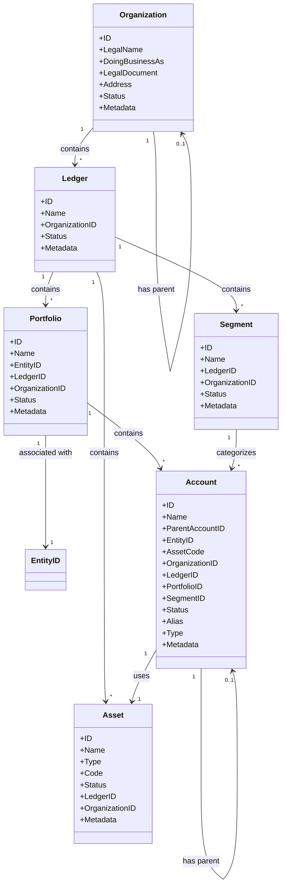
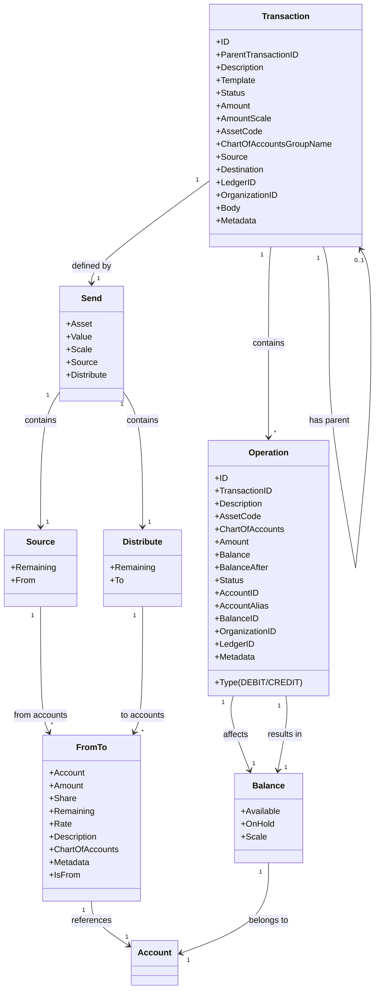
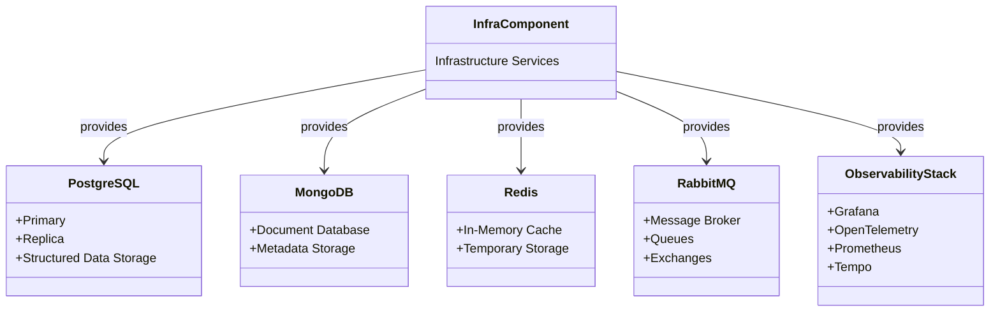

# Midaz Entity Relationships

This document provides visual representations of the entity relationships within the Midaz platform.

## Onboarding Component Entity Relationships



## Transaction Component Entity Relationships



## Infrastructure Component Services



## Integration Between Components

```mermaid
flowchart TB
    subgraph "Infrastructure Component"
        PostgreSQL[(PostgreSQL)]
        MongoDB[(MongoDB)]
        Redis[(Redis)]
        RabbitMQ{RabbitMQ}
        Observability[Grafana/OpenTelemetry]
    end
    
    subgraph "Onboarding Component"
        Organization --> Ledger
        Ledger --> Segment
        Ledger --> Portfolio
        Ledger --> Asset
        Portfolio --> Account
        Segment --> Account
        Asset --> Account
    end
    
    subgraph "Transaction Component"
        Transaction --> Operation
        Operation --> Balance
    end
    
    Account --> Balance
    Transaction -.-> Organization
    Transaction -.-> Ledger
    
    Onboarding Component -.-> PostgreSQL
    Onboarding Component -.-> MongoDB
    Onboarding Component -.-> Redis
    Onboarding Component -.-> RabbitMQ
    
    Transaction Component -.-> PostgreSQL
    Transaction Component -.-> MongoDB
    Transaction Component -.-> Redis
    Transaction Component -.-> RabbitMQ
    
    Onboarding Component -.-> Observability
    Transaction Component -.-> Observability
    
    style Organization fill:#f9d5e5,stroke:#333,stroke-width:1px
    style Ledger fill:#f9d5e5,stroke:#333,stroke-width:1px
    style Segment fill:#f9d5e5,stroke:#333,stroke-width:1px
    style Portfolio fill:#f9d5e5,stroke:#333,stroke-width:1px
    style Account fill:#f9d5e5,stroke:#333,stroke-width:1px
    style Asset fill:#f9d5e5,stroke:#333,stroke-width:1px
    
    style Transaction fill:#d5e5f9,stroke:#333,stroke-width:1px
    style Operation fill:#d5e5f9,stroke:#333,stroke-width:1px
    style Balance fill:#d5e5f9,stroke:#333,stroke-width:1px
    
    style PostgreSQL fill:#e5f9d5,stroke:#333,stroke-width:1px
    style MongoDB fill:#e5f9d5,stroke:#333,stroke-width:1px
    style Redis fill:#e5f9d5,stroke:#333,stroke-width:1px
    style RabbitMQ fill:#e5f9d5,stroke:#333,stroke-width:1px
    style Observability fill:#e5f9d5,stroke:#333,stroke-width:1px
``` 