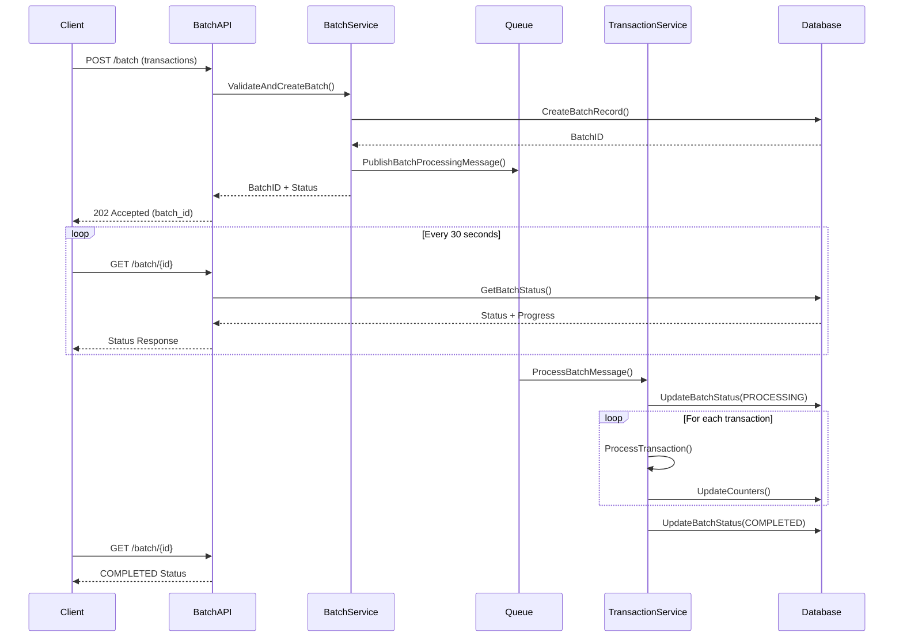
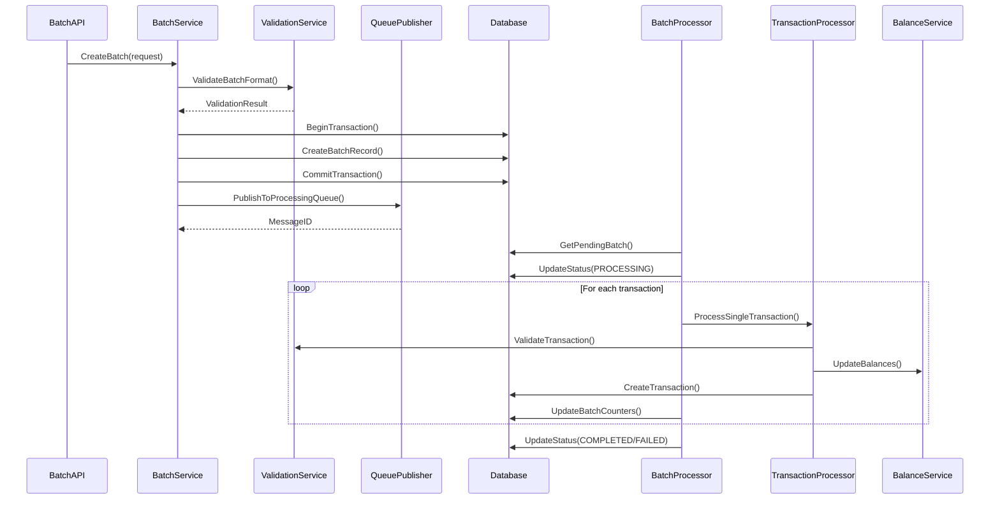
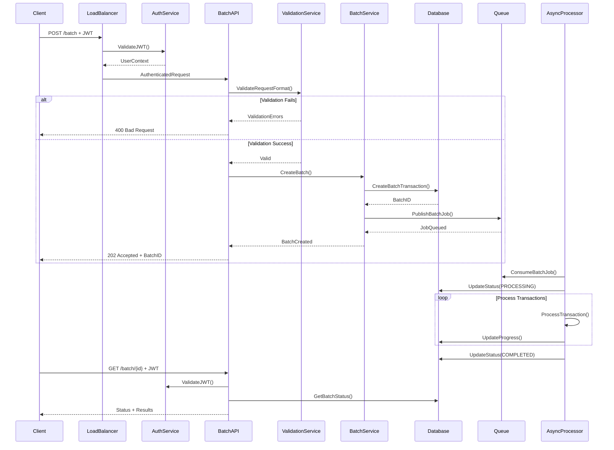

# Product Requirements Document: Batch Transaction Processing

## 0. Index
///REVIEW

## 1. Introduction/Overview

The Batch Transaction Processing feature introduces a new `/batch` endpoint to the Midaz transaction component that enables financial institutions to submit and process large volumes of transactions asynchronously. This feature addresses performance bottlenecks, reduces API overhead, and provides configurable atomicity guarantees for bulk transaction operations.

Currently, the Midaz transaction system processes transactions individually through synchronous API calls, which creates significant overhead for financial institutions handling thousands of daily transactions. The batch processing feature will leverage the existing async infrastructure while introducing batch-level tracking and management capabilities.

**Goal**: Enable efficient, scalable, and reliable batch processing of up to 10,000+ transactions with configurable atomicity and comprehensive status tracking.

## 2. Goals

1. **Performance Optimization**: Reduce transaction processing time by 10x compared to individual API calls
2. **API Efficiency**: Achieve 99% reduction in API calls for bulk operations  
3. **Scalability**: Support batch sizes of 10,000+ transactions with linear performance scaling
4. **Reliability**: Maintain <1% system error rate during batch processing operations
5. **Flexibility**: Provide configurable atomicity modes (individual vs. batch-level)
6. **Observability**: Enable comprehensive tracking and monitoring of batch processing status
7. **Integration**: Seamlessly integrate with existing Midaz transaction infrastructure

## 3. User Stories

### Primary User: Financial Institution Operations Manager
**Background**: Manages daily settlement operations, handles bulk payment processing, and ensures compliance with financial regulations.

**User Stories**:

1. **Bulk Settlement Processing**
   - *As a* financial operations manager
   - *I want to* submit 5,000 daily settlement transactions in a single batch request
   - *So that* I can reduce processing time from 2 hours to 15 minutes and minimize system load

2. **Payroll Processing**
   - *As a* payroll processor
   - *I want to* process 1,200 employee salary transactions with atomic guarantee
   - *So that* either all employees get paid or none do, avoiding partial payroll runs

3. **Merchant Settlement**
   - *As a* payment processor
   - *I want to* submit 8,000 merchant settlement transactions with best-effort processing
   - *So that* successful settlements complete immediately while failed ones are reported for manual review

4. **End-of-Day Reconciliation**
   - *As a* accounting system operator
   - *I want to* track the progress of my 3,000-transaction batch in real-time
   - *So that* I can provide accurate status updates to stakeholders and plan dependent operations

5. **Risk Management Validation**
   - *As a* compliance officer
   - *I want to* pre-evaluate a batch of 2,000 transactions before processing
   - *So that* I can identify potential compliance issues without affecting live balances

### Secondary User: API Integration Developer
**Background**: Integrates third-party systems with Midaz, optimizes performance, and handles error scenarios.

**User Stories**:

6. **System Integration Optimization**
   - *As an* integration developer
   - *I want to* batch 500 e-commerce transactions instead of making individual API calls
   - *So that* I can reduce network overhead and improve application response times

7. **Error Handling and Recovery**
   - *As an* integration developer
   - *I want to* receive detailed error reports for failed transactions in my batch
   - *So that* I can implement proper retry logic and error handling in my application

## 4. User Experience

### User Personas

**Primary Persona: Financial Operations Manager**
- **Experience**: 5-10 years in financial operations, familiar with batch processing concepts
- **Technical Skill**: Medium - understands APIs but relies on technical teams for implementation
- **Goals**: Process large volumes efficiently, ensure regulatory compliance, minimize operational risk
- **Pain Points**: Long processing times, potential for partial failures, limited visibility into processing status
- **Preferred Interaction**: Simple status monitoring, clear error reporting, reliable completion notifications

**Secondary Persona: Integration Developer**
- **Experience**: 3-7 years in software development, experienced with financial APIs
- **Technical Skill**: High - deep understanding of API design, error handling, and async processing
- **Goals**: Optimize system performance, implement robust error handling, maintain data consistency
- **Pain Points**: Complex error scenarios, lack of granular status information, inconsistent response formats
- **Preferred Interaction**: Detailed API responses, comprehensive error codes, predictable async patterns

### Key User Flows

**Flow 1: Batch Submission and Monitoring**
1. User prepares batch of JSON transactions (up to 10k)
2. User submits POST request to `/batch` endpoint with atomicity flag
3. System validates request format and returns batch UUID immediately
4. User periodically polls GET `/batch/{uuid}` endpoint for status updates
5. User receives final status with detailed results and error reports

**Flow 2: Pre-Evaluation Workflow**
1. User submits batch to `/batch/preeval` endpoint for validation
2. System performs comprehensive validation without creating transactions
3. User receives validation report with potential issues identified
4. User corrects issues and submits final batch for processing

**Flow 3: Error Recovery Process**
1. User receives batch completion notification with partial failures
2. User queries batch status to retrieve detailed error list
3. User corrects failed transactions and resubmits as new batch
4. User tracks both original and corrected batch completion

### Interaction Patterns

- **Async-First Design**: All batch operations return immediately with tracking UUID
- **Progressive Status Updates**: Status moves through defined states (PENDING → PROCESSING → COMPLETED/FAILED)
- **Error Aggregation**: Individual transaction errors collected and reported at batch level
- **Idempotent Operations**: Batch submissions can be safely retried with same UUID

## 5. Functional Requirements

1. **Batch Submission Endpoint**
   - The system must accept JSON batch transaction requests via POST `/v1/organizations/{org_id}/ledgers/{ledger_id}/transactions/batch`
   - The system must support up to 10,000 transactions per batch request
   - The system must validate request format and return batch UUID within 5 seconds
   - The system must accept optional `atomic_mode` boolean flag (default: false)
   - The system must accept optional `callback_url` for completion notifications

2. **Async Batch Processing**
   - The system must process batches asynchronously using existing RabbitMQ infrastructure
   - The system must maintain individual transaction atomicity regardless of batch atomicity setting
   - The system must support atomic batch mode where all transactions succeed or all fail
   - The system must support best-effort mode where individual failures don't affect other transactions

3. **Batch Status Tracking**
   - The system must provide GET `/v1/organizations/{org_id}/ledgers/{ledger_id}/transactions/batch/{batch_id}` endpoint
   - The system must track batch states: PENDING, PROCESSING, COMPLETED, FAILED, PARTIALLY_COMPLETED
   - The system must maintain transaction counters: total, successful, failed, processing
   - The system must provide estimated completion time based on current processing rate

4. **Pre-Evaluation Endpoint**
   - The system must provide POST `/v1/organizations/{org_id}/ledgers/{ledger_id}/transactions/batch/preeval` endpoint
   - The system must validate all transactions without creating database records
   - The system must return comprehensive validation report within 30 seconds
   - The system must check business rules, account balances, and data constraints

5. **Error Reporting and Management**
   - The system must collect individual transaction errors during processing
   - The system must provide detailed error reports including transaction index and error description
   - The system must categorize errors as validation, business rule, or system errors
   - The system must maintain error history for audit and debugging purposes

6. **Integration with Existing Systems**
   - The system must use existing transaction validation logic for individual transactions
   - The system must respect existing ledger and organization access controls
   - The system must integrate with current balance updating mechanisms
   - The system must maintain compatibility with existing transaction status workflows

7. **Performance and Scalability**
   - The system must process 10,000 transactions within 10 minutes under normal load
   - The system must support concurrent batch processing across different ledgers
   - The system must implement appropriate database connection pooling for batch operations
   - The system must provide monitoring metrics for batch processing performance

## 6. Non-Goals (Out of Scope)

- **UI Dashboard**: No web interface for batch monitoring (API-only implementation)
- **CSV File Processing**: File upload support not included in MVP (future enhancement)
- **DSL Batch Support**: Domain Specific Language transactions not supported in initial version
- **Cross-Ledger Batches**: Batches spanning multiple ledgers or organizations not supported
- **Real-time Status Updates**: WebSocket or Server-Sent Events not implemented (polling only)
- **Batch Scheduling**: Delayed or scheduled batch execution not included
- **Webhook Retries**: Advanced webhook delivery guarantees not implemented
- **Batch Templates**: Pre-defined batch transaction templates not included
- **Partial Batch Resumption**: Ability to resume failed batches not supported

## 7. Design Considerations

- **API Consistency**: Batch endpoints follow existing Midaz REST API conventions and response formats
- **Response Format**: JSON responses maintain consistency with individual transaction endpoints
- **Authentication**: Batch endpoints use existing lib-auth authentication and authorization mechanisms
- **Rate Limiting**: Implement batch-specific rate limits to prevent system overload
- **Monitoring Integration**: Leverage existing observability infrastructure for batch processing metrics
- **Error Response Format**: Standardized error response structure for both validation and processing errors

## 8. Technical Considerations

- **Database Performance**: Batch processing may require database query optimization and connection pooling adjustments
- **Memory Management**: Large batches (10k+ transactions) require careful memory allocation and garbage collection considerations
- **Queue Management**: Leverage existing RabbitMQ infrastructure while preventing queue blocking for individual transactions
- **Transaction Isolation**: Ensure proper database transaction isolation levels for atomic batch processing
- **Async Processing Architecture**: Build upon existing async transaction processing patterns in the codebase
- **lib-commons Integration**: Use lib-commons utilities for error handling, validation, and observability
- **lib-auth Integration**: Implement authentication and authorization using existing lib-auth patterns

## 9. Success Metrics

### Performance Metrics
- **Processing Speed**: 10x improvement over individual API calls (target: 10k transactions in <10 minutes)
- **API Efficiency**: 99% reduction in API calls for bulk operations
- **System Throughput**: Maintain or improve overall system transaction throughput
- **Resource Utilization**: CPU and memory usage remains within acceptable limits during batch processing

### Reliability Metrics
- **System Error Rate**: <1% system errors during batch processing (excluding business validation errors)
- **Batch Completion Rate**: >99% of submitted batches complete successfully or with identifiable errors
- **Data Consistency**: 100% consistency between batch status and actual transaction states
- **System Availability**: No degradation of existing transaction processing during batch operations

### User Experience Metrics
- **Status Query Response Time**: Batch status queries complete within 2 seconds
- **Error Report Completeness**: 100% of transaction errors captured and reported in batch status
- **Pre-evaluation Accuracy**: >95% correlation between pre-evaluation results and actual processing outcomes

## 10. Data Modeling

### New Entities

**BatchTransaction Entity**
- `id`: UUID (required, unique, primary key)
- `organization_id`: UUID (required, foreign key to organization)
- `ledger_id`: UUID (required, foreign key to ledger)
- `status`: String (required, enum: PENDING, PROCESSING, COMPLETED, FAILED, PARTIALLY_COMPLETED)
- `atomic_mode`: Boolean (required, default: false)
- `total_transactions`: Integer (required, min: 1, max: 10000)
- `successful_transactions`: Integer (required, default: 0)
- `failed_transactions`: Integer (required, default: 0)
- `processing_transactions`: Integer (required, default: 0)
- `callback_url`: String (optional, valid URL format)
- `error_summary`: JSONB (optional, aggregated error information)
- `estimated_completion_at`: Timestamp (optional, calculated based on processing rate)
- `created_at`: Timestamp (required, auto-generated)
- `updated_at`: Timestamp (required, auto-updated)
- `completed_at`: Timestamp (optional, set when processing completes)

**BatchTransactionError Entity**
- `id`: UUID (required, unique, primary key)
- `batch_id`: UUID (required, foreign key to batch_transaction)
- `transaction_index`: Integer (required, position in original batch array)
- `error_type`: String (required, enum: VALIDATION, BUSINESS_RULE, SYSTEM)
- `error_code`: String (required, standardized error code)
- `error_message`: String (required, human-readable error description)
- `transaction_data`: JSONB (required, original transaction payload that failed)
- `created_at`: Timestamp (required, auto-generated)

### Modified Entities

**Transaction Entity Updates**
- Add `batch_id`: UUID (optional, foreign key to batch_transaction)
- Add index on `batch_id` for efficient batch-related queries

### Entity Relationships

- **BatchTransaction has many Transactions**: One batch contains multiple transactions
- **BatchTransaction has many BatchTransactionErrors**: One batch can have multiple errors
- **Transaction belongs to BatchTransaction**: Individual transaction optionally belongs to a batch
- **BatchTransactionError belongs to BatchTransaction**: Each error is associated with specific batch

### Data Validation Rules

- **Batch Size Limits**: 1 ≤ total_transactions ≤ 10,000
- **Status Transitions**: PENDING → PROCESSING → [COMPLETED|FAILED|PARTIALLY_COMPLETED]
- **Counter Consistency**: successful_transactions + failed_transactions + processing_transactions = total_transactions
- **Organization/Ledger Scope**: All transactions in batch must belong to same organization/ledger
- **URL Validation**: callback_url must be valid HTTP/HTTPS URL if provided

## 11. API Modeling

### Create Batch Transaction

**POST** `/v1/organizations/{organization_id}/ledgers/{ledger_id}/transactions/batch`

**Purpose**: Submit a new batch of transactions for asynchronous processing

**Authentication**: Required (lib-auth JWT validation)

**Request Body**:
```json
{
  "batch_id": "550e8400-e29b-41d4-a716-446655440000",
  "atomic_mode": false,
  "callback_url": "https://client.example.com/webhooks/batch-complete",
  "transactions": [
    {
      "id": "123e4567-e89b-12d3-a456-426614174000",
      "description": "Payment to vendor A",
      "amount": {
        "value": 10050,
        "scale": 2
      },
      "asset_code": "USD",
      "from": {
        "account_id": "acc-001"
      },
      "to": {
        "account_id": "acc-002"
      },
      "metadata": {
        "invoice_id": "INV-001"
      }
    },
    {
      "id": "123e4567-e89b-12d3-a456-426614174001",
      "description": "Payment to vendor B",
      "amount": {
        "value": 5000,
        "scale": 2
      },
      "asset_code": "USD",
      "from": {
        "account_id": "acc-001"
      },
      "to": {
        "account_id": "acc-003"
      }
    }
  ]
}
```

**Response (202 Accepted)**:
```json
{
  "batch_id": "550e8400-e29b-41d4-a716-446655440000",
  "status": "PENDING",
  "total_transactions": 2,
  "estimated_completion_at": "2024-01-15T10:30:00Z",
  "created_at": "2024-01-15T10:15:00Z"
}
```

### Get Batch Status

**GET** `/v1/organizations/{organization_id}/ledgers/{ledger_id}/transactions/batch/{batch_id}`

**Purpose**: Retrieve current status and progress of a batch transaction

**Authentication**: Required

**Response (200 OK)**:
```json
{
  "batch_id": "550e8400-e29b-41d4-a716-446655440000",
  "status": "PROCESSING",
  "atomic_mode": false,
  "total_transactions": 2,
  "successful_transactions": 1,
  "failed_transactions": 0,
  "processing_transactions": 1,
  "progress_percentage": 50,
  "estimated_completion_at": "2024-01-15T10:30:00Z",
  "created_at": "2024-01-15T10:15:00Z",
  "updated_at": "2024-01-15T10:20:00Z",
  "errors": [],
  "successful_transaction_ids": [
    "123e4567-e89b-12d3-a456-426614174000"
  ]
}
```

### Pre-Evaluate Batch

**POST** `/v1/organizations/{organization_id}/ledgers/{ledger_id}/transactions/batch/preeval`

**Purpose**: Validate batch transactions without creating actual transactions

**Authentication**: Required

**Request Body**: Same as create batch transaction

**Response (200 OK)**:
```json
{
  "validation_id": "val-550e8400-e29b-41d4-a716-446655440000",
  "total_transactions": 2,
  "valid_transactions": 1,
  "invalid_transactions": 1,
  "validation_errors": [
    {
      "transaction_index": 1,
      "error_type": "BUSINESS_RULE",
      "error_code": "INSUFFICIENT_BALANCE",
      "error_message": "Account acc-001 has insufficient balance for transaction amount 5000",
      "transaction_id": "123e4567-e89b-12d3-a456-426614174001"
    }
  ],
  "estimated_processing_time": "00:05:30",
  "validated_at": "2024-01-15T10:15:00Z"
}
```

### Error Responses

**400 Bad Request** (Validation Error):
```json
{
  "error": {
    "code": "INVALID_BATCH_REQUEST",
    "message": "Batch request validation failed",
    "details": [
      {
        "field": "transactions",
        "message": "Batch must contain between 1 and 10000 transactions"
      }
    ]
  }
}
```

**404 Not Found** (Batch Not Found):
```json
{
  "error": {
    "code": "BATCH_NOT_FOUND",
    "message": "Batch transaction not found",
    "batch_id": "550e8400-e29b-41d4-a716-446655440000"
  }
}
```

## 12. Sequence Diagrams

### User Interaction Flow



### System Internal Flow



### Full API Workflow



## 13. Development Roadmap

### Phase 1 - MVP: Core Batch Processing (4-6 weeks)
**Scope**: Basic batch transaction processing with essential features
- [ ] Batch submission endpoint with JSON transaction support
- [ ] Async processing using existing RabbitMQ infrastructure
- [ ] Basic batch status tracking (PENDING, PROCESSING, COMPLETED, FAILED)
- [ ] Individual transaction atomicity (no batch atomicity)
- [ ] Simple error collection and reporting
- [ ] Database schema for batch tracking
- [ ] Integration with existing transaction validation

**Deliverables**:
- POST `/batch` endpoint accepting up to 1,000 transactions
- GET `/batch/{id}` status endpoint
- Batch processing service using existing async patterns
- Basic monitoring and logging

### Phase 2 - Enhanced Features (3-4 weeks)
**Scope**: Advanced batch features and improved user experience
- [ ] Batch atomicity mode (atomic_mode flag)
- [ ] Pre-evaluation endpoint for validation without processing
- [ ] Increased batch size support (up to 10,000 transactions)
- [ ] Enhanced error reporting with categorization
- [ ] Callback URL support for completion notifications
- [ ] Performance optimizations for large batches

**Deliverables**:
- POST `/batch/preeval` endpoint
- Atomic batch processing mode
- Webhook notification system
- Optimized database queries for batch operations
- Comprehensive error categorization

### Phase 3 - Scale and Monitoring (2-3 weeks)
**Scope**: Production readiness and operational excellence
- [ ] Advanced monitoring and metrics collection
- [ ] Performance tuning for high-volume processing
- [ ] Comprehensive integration testing
- [ ] Documentation and operational runbooks
- [ ] Load testing with 10k+ transaction batches
- [ ] Production deployment pipeline

**Deliverables**:
- Observability dashboard for batch processing
- Performance benchmarks and SLA definitions
- Complete API documentation
- Production deployment automation
- Monitoring alerts and runbooks

### Phase 4 - Future Enhancements (Future Release)
**Scope**: Extended functionality beyond MVP requirements
- [ ] CSV file upload and processing
- [ ] DSL (Domain Specific Language) batch support
- [ ] Batch scheduling and delayed execution
- [ ] Advanced webhook retry mechanisms
- [ ] Batch templates and reusable configurations
- [ ] Cross-ledger batch processing capabilities

## 14. Logical Dependency Chain

### Foundation Layer (Must be built first)
1. **Database Schema Design**
   - Create batch_transaction table with proper indexing
   - Add batch_id foreign key to existing transaction table
   - Create batch_transaction_error table for error tracking
   - Set up proper database migrations

2. **Domain Models and Entities**
   - BatchTransaction entity with all required fields
   - BatchTransactionError entity for error tracking
   - Update Transaction entity to include batch relationship
   - Validation rules and business logic for batch operations

3. **Core Service Infrastructure**
   - Batch service interface and implementation
   - Integration with existing validation service
   - Database repository pattern for batch operations
   - Error handling and aggregation utilities

### Usable Frontend Path (Quick wins for visibility)
4. **Basic Batch Creation**
   - POST `/batch` endpoint with minimal validation
   - Simple batch record creation in database
   - Return batch UUID immediately to client
   - Basic status tracking (PENDING status only)

5. **Status Monitoring**
   - GET `/batch/{id}` endpoint for status queries
   - Basic batch status representation
   - Progress percentage calculation
   - Error count aggregation

6. **Async Processing Foundation**
   - RabbitMQ queue integration for batch processing
   - Basic batch consumer that processes transactions sequentially
   - Status updates during processing (PROCESSING, COMPLETED)
   - Simple error collection during processing

### Advanced Features (Build upon foundation)
7. **Enhanced Validation and Pre-evaluation**
   - POST `/batch/preeval` endpoint implementation
   - Comprehensive validation without side effects
   - Detailed validation report generation
   - Integration with existing transaction validation rules

8. **Atomic Batch Processing**
   - Database transaction management for atomic batches
   - Rollback mechanisms for failed atomic batches
   - Status handling for atomic vs. best-effort modes
   - Enhanced error reporting for atomic failures

9. **Production Optimizations**
   - Batch size optimization and memory management
   - Database connection pooling for large batches
   - Performance monitoring and metrics collection
   - Comprehensive error handling and recovery

### Integration and Polish (Final improvements)
10. **Webhook and Notification System**
    - Callback URL validation and storage
    - Webhook delivery mechanism for batch completion
    - Retry logic for failed webhook deliveries
    - Security considerations for webhook endpoints

11. **Monitoring and Observability**
    - Metrics collection for batch processing performance
    - Logging integration with existing observability stack
    - Dashboard and alerting for batch operations
    - Performance profiling and optimization

## 15. Risks and Mitigations

### Technical Risks

**Risk: Database Performance Degradation**
- **Impact**: High - Large batches could slow down database for other operations
- **Probability**: Medium
- **Mitigation**: Implement connection pooling, batch size limits, and database query optimization
- **Contingency**: Add read replicas for status queries, implement batch processing throttling

**Risk: Memory Exhaustion with Large Batches**
- **Impact**: High - 10k+ transactions could cause out-of-memory errors
- **Probability**: Medium
- **Mitigation**: Stream processing approach, memory profiling, garbage collection tuning
- **Contingency**: Implement adaptive batch size limits based on available memory

**Risk: Queue Blocking and Processing Delays**
- **Impact**: Medium - Large batches could block individual transaction processing
- **Probability**: Low
- **Mitigation**: Separate batch processing queues, priority-based message handling
- **Contingency**: Emergency queue draining procedures, manual batch processing

### Product Risks

**Risk: Complex Atomicity Implementation**
- **Impact**: High - Atomic batch processing complexity could delay MVP delivery
- **Probability**: Medium
- **Mitigation**: Implement non-atomic mode first, add atomicity as Phase 2 feature
- **Contingency**: Reduce scope to individual transaction atomicity only

**Risk: Insufficient Error Reporting**
- **Impact**: Medium - Poor error visibility could reduce feature adoption
- **Probability**: Low
- **Mitigation**: Comprehensive error categorization and detailed error reporting
- **Contingency**: Implement basic error logging with manual error analysis tools

**Risk: Performance Expectations Not Met**
- **Impact**: Medium - Failure to achieve 10x performance improvement
- **Probability**: Low
- **Mitigation**: Early performance testing, benchmark establishment, incremental optimization
- **Contingency**: Adjust performance targets based on realistic benchmarks

### Resource Risks

**Risk: Integration Complexity with Existing Systems**
- **Impact**: Medium - Complex integration could extend development timeline
- **Probability**: Medium
- **Mitigation**: Leverage existing async patterns, incremental integration approach
- **Contingency**: Simplified integration with manual migration path for edge cases

**Risk: Testing and Quality Assurance Challenges**
- **Impact**: Medium - Complex async behavior difficult to test comprehensively
- **Probability**: Medium
- **Mitigation**: Comprehensive test suite including integration and load tests
- **Contingency**: Phased rollout with limited user groups for validation

## 16. Architecture Patterns & Principles

### Hexagonal Architecture (Mandatory)

**ALL batch transaction functionality MUST follow Hexagonal Architecture principles.**

**Required Directory Structure**:
```
components/transaction/internal/
├── domain/
│   ├── entities/
│   │   ├── batch_transaction.go     # Core batch business entity
│   │   └── batch_error.go           # Batch error domain model
│   ├── services/
│   │   ├── batch_processor.go       # Batch processing business logic
│   │   └── batch_validator.go       # Batch validation business rules
│   └── ports/
│       ├── batch_repository.go      # Batch storage interface
│       ├── batch_queue.go           # Batch queue interface
│       └── webhook_notifier.go      # Webhook notification interface
├── adapters/
│   ├── primary/
│   │   └── http/
│   │       └── batch_handler.go     # HTTP API endpoints
│   ├── secondary/
│   │   ├── postgres/
│   │   │   └── batch_repository.go  # Database implementation
│   │   ├── rabbitmq/
│   │   │   └── batch_queue.go       # Queue implementation
│   │   └── webhook/
│   │       └── notifier.go          # Webhook implementation
│   └── config/
│       └── batch_config.go          # Batch configuration
└── infrastructure/
    ├── database/
    │   └── batch_migrations/         # Batch-specific migrations
    ├── observability/
    │   └── batch_metrics.go          # Batch monitoring
    └── security/
        └── batch_auth.go             # Batch authorization
```

**Validation Checklist**:
- [ ] **Domain Isolation**: Batch domain layer has no external dependencies
- [ ] **Port Interfaces**: All external dependencies (DB, queue, webhooks) defined as interfaces
- [ ] **Adapter Implementation**: Clear separation of inbound HTTP and outbound storage/queue adapters
- [ ] **Dependency Injection**: Proper DI container configuration for batch services
- [ ] **Testing Strategy**: Easy to unit test batch business logic in isolation

### Repository Patterns

**REQUIRED**: Extend existing transaction component repository patterns for batch functionality.

**Existing Boilerplate Compliance**:
- [ ] **Hexagonal Structure**: Follow existing transaction component structure
- [ ] **lib-commons Integration**: Use shared utilities for error handling and validation
- [ ] **lib-auth Integration**: Use existing authentication patterns for batch endpoints
- [ ] **Observability Setup**: Extend existing OpenTelemetry, logging, metrics
- [ ] **Testing Framework**: Use existing unit, integration, and e2e test patterns

### lib-commons Integration (Mandatory)

**MANDATORY**: Use lib-commons for all shared functionality.

**Required lib-commons Components**:
- [ ] **Error Handling**: Use standardized error types for batch validation and processing errors
- [ ] **Validation**: Use common validation patterns for batch request validation
- [ ] **Database Utilities**: Use existing connection pooling and migration tools
- [ ] **Observability**: Use logging, metrics, tracing utilities for batch operations
- [ ] **Configuration**: Use environment and config management for batch settings

### lib-auth Integration (Mandatory for Midaz)

**MANDATORY**: Use lib-auth for authentication and authorization.

**Required lib-auth Components**:
- [ ] **Authentication**: JWT token validation for batch endpoints
- [ ] **Authorization**: RBAC utilities for batch operation permissions
- [ ] **Security Middleware**: Request authentication and authorization for batch APIs
- [ ] **User Management**: User context and session handling in batch operations

**Integration Checklist**:
- [ ] **Version Compatibility**: Use latest stable lib-commons and lib-auth versions
- [ ] **API Compliance**: Follow lib-commons and lib-auth interface contracts
- [ ] **Error Propagation**: Use lib-commons error types consistently in batch operations
- [ ] **Authentication Flow**: Implement lib-auth authentication patterns for batch endpoints
- [ ] **Authorization Patterns**: Use lib-auth RBAC utilities for batch permissions
- [ ] **Testing Integration**: Use lib-commons and lib-auth test utilities for batch tests

### Architectural Principles

**SOLID Principles Enforcement**:
- [ ] **Single Responsibility**: BatchProcessor handles only batch coordination, not individual transactions
- [ ] **Open/Closed**: Batch validation rules extensible without modifying core processor
- [ ] **Liskov Substitution**: BatchRepository implementations interchangeable
- [ ] **Interface Segregation**: Separate interfaces for batch creation, status, and processing
- [ ] **Dependency Inversion**: Batch services depend on interfaces, not concrete implementations

**YAGNI, DRY, KISS Compliance**:
- [ ] **YAGNI**: No premature optimization for batch sizes beyond 10k transactions
- [ ] **DRY**: Extract common batch patterns to lib-commons for reuse
- [ ] **KISS**: Simple async processing model, complex features in later phases

**Domain-Driven Design (DDD)**:
- [ ] **Bounded Contexts**: Clear batch transaction context separate from individual transactions
- [ ] **Ubiquitous Language**: Consistent batch terminology (batch, atomic_mode, pre-evaluation)
- [ ] **Domain Models**: Rich BatchTransaction entity with business logic
- [ ] **Repository Pattern**: BatchRepository for data access abstraction
- [ ] **Domain Events**: Batch completion events for webhook notifications

### Quality Standards Integration

**Code Quality Requirements**:
- [ ] **Go Standards**: Follow existing Go code standards in transaction component
- [ ] **Test Coverage**: Minimum 80% test coverage for batch functionality
- [ ] **Documentation**: Comprehensive GoDoc comments for all public interfaces
- [ ] **Error Handling**: Explicit error handling for all batch operations
- [ ] **Performance**: Sub-linear memory usage for batch processing

**Integration with Existing Patterns**:
- [ ] **Transaction Validation**: Reuse existing transaction validation logic
- [ ] **Async Processing**: Extend existing RabbitMQ async patterns
- [ ] **Database Schema**: Follow existing migration and indexing patterns
- [ ] **API Conventions**: Match existing REST API response formats
- [ ] **Monitoring**: Integrate with existing observability infrastructure

## 17. Open Questions

1. **Webhook Security**: What authentication mechanism should be used for webhook callbacks? Should we implement webhook signatures for security?

2. **Batch Size Optimization**: What's the optimal batch size for database performance? Should we implement dynamic batch size adjustment based on system load?

3. **Retry Logic**: How should failed individual transactions within a batch be handled? Should there be automatic retry mechanisms?

4. **Monitoring Granularity**: What level of detail should be exposed in batch processing metrics? Should we track processing time per transaction within batches?

5. **Backwards Compatibility**: How should batch-created transactions appear in existing transaction listing APIs? Should they be distinguishable from individually created transactions?

6. **Rate Limiting**: Should batch operations have different rate limits compared to individual transactions? How should concurrent batch processing be throttled?

7. **Audit Trail**: What additional audit information should be captured for batch operations? Should batch processing events be logged separately from individual transactions?

8. **Error Recovery**: Should there be mechanisms to retry failed transactions from a completed batch? How should partial batch recovery be handled?

---

**Next Steps**: After completing this PRD, the next step is to create a Technical Requirements Document (TRD) using `@docs/ai-prompts/1-pre-development/2-create-trd.mdc` to define the detailed technical implementation approach.