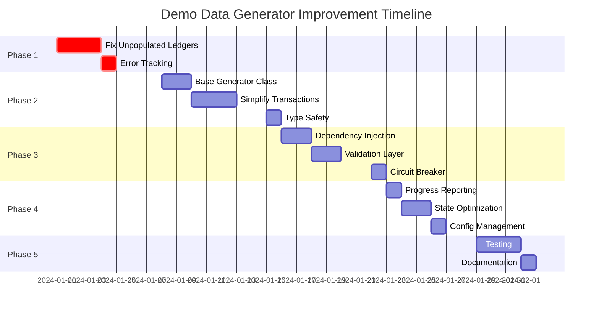

# Demo Data Generator Improvement Plan

## Overview

This plan outlines the systematic approach to fix critical issues and implement improvements identified in the architecture analysis. The work is organized into phases with clear priorities and dependencies.

## Phase 1: Critical Fixes (Week 1)

### 1.1 Fix Unpopulated Ledgers Issue 🚨

**Priority**: P0 - Critical  
**Estimated Time**: 2-3 days  
**Files to Modify**: 
- `src/generator.ts`
- `src/generators/assets.ts`
- `src/generators/accounts.ts`
- `src/utils/state.ts`

**Tasks**:
1. **Add Pre-Generation Validation**
   ```typescript
   // In generator.ts - Add validation before dependent entity generation
   private async validateDependencies(ledgerId: string): Promise<boolean> {
     const assets = this.stateManager.getAssetCodes(ledgerId);
     if (assets.length === 0) {
       this.logger.error(`No assets found for ledger ${ledgerId}`);
       return false;
     }
     return true;
   }
   ```

2. **Fix Organization Context Propagation**
   ```typescript
   // Update all generators to accept organizationId explicitly
   async generate(count: number, parentId: string, organizationId: string): Promise<T[]>
   ```

3. **Add Generation Verification**
   ```typescript
   // Add verification after each generation step
   private async verifyGeneration<T>(
     entities: T[], 
     entityType: string, 
     minimumRequired: number = 1
   ): void {
     if (entities.length < minimumRequired) {
       throw new GenerationError(
         `Failed to generate minimum ${minimumRequired} ${entityType}s, got ${entities.length}`
       );
     }
   }
   ```

4. **Implement Retry with Backoff**
   ```typescript
   // Add retry mechanism for critical entities
   private async generateWithRetry<T>(
     generator: () => Promise<T[]>,
     entityType: string,
     maxRetries: number = 3
   ): Promise<T[]> {
     for (let attempt = 1; attempt <= maxRetries; attempt++) {
       try {
         const result = await generator();
         if (result.length > 0) return result;
       } catch (error) {
         if (attempt === maxRetries) throw error;
         await this.wait(Math.pow(2, attempt) * 1000);
       }
     }
     return [];
   }
   ```

**Success Criteria**:
- [ ] All ledgers have at least one asset
- [ ] All ledgers with assets have accounts
- [ ] No silent failures in generation chain
- [ ] Clear error messages when generation fails

### 1.2 Add Comprehensive Error Tracking

**Priority**: P0 - Critical  
**Estimated Time**: 1 day  
**Files to Modify**: 
- `src/types.ts`
- `src/utils/state.ts`
- All generator files

**Tasks**:
1. **Create Error Tracking System**
   ```typescript
   interface GenerationError {
     entityType: string;
     parentId: string;
     error: Error;
     timestamp: Date;
     context: Record<string, any>;
   }
   
   class ErrorTracker {
     private errors: GenerationError[] = [];
     
     trackError(error: GenerationError): void;
     getErrorsByType(entityType: string): GenerationError[];
     generateReport(): ErrorReport;
   }
   ```

2. **Update State Manager**
   ```typescript
   // Add to StateManager
   private errorTracker = new ErrorTracker();
   
   trackGenerationError(
     entityType: string,
     parentId: string,
     error: Error,
     context?: Record<string, any>
   ): void {
     this.errorTracker.trackError({
       entityType,
       parentId,
       error,
       timestamp: new Date(),
       context: context || {}
     });
   }
   ```

## Phase 2: Code Quality Improvements (Week 2)

### 2.1 Extract Base Generator Class

**Priority**: P1 - High  
**Estimated Time**: 2 days  
**Files to Create/Modify**:
- `src/generators/base.generator.ts` (new)
- All generator files (refactor)

**Tasks**:
1. **Create Base Generator**
   ```typescript
   export abstract class BaseGenerator<T> implements EntityGenerator<T> {
     constructor(
       protected client: MidazClient,
       protected logger: Logger,
       protected stateManager: StateManager
     ) {}
     
     abstract generate(count: number, parentId?: string, context?: any): Promise<T[]>;
     abstract generateOne(parentId?: string, context?: any): Promise<T>;
     
     protected async handleConflict(
       error: Error,
       entityName: string,
       retriever: () => Promise<T>
     ): Promise<T | null> {
       if (this.isConflictError(error)) {
         this.logger.warn(`${entityName} may already exist, attempting retrieval`);
         try {
           return await retriever();
         } catch (retrieveError) {
           this.logger.error(`Failed to retrieve existing ${entityName}`, retrieveError);
           return null;
         }
       }
       throw error;
     }
     
     protected isConflictError(error: Error): boolean {
       return error.message.includes('already exists') || 
              error.message.includes('conflict');
     }
     
     protected async withRetry<R>(
       operation: () => Promise<R>,
       operationName: string,
       maxRetries: number = 3
     ): Promise<R> {
       let lastError: Error;
       
       for (let attempt = 1; attempt <= maxRetries; attempt++) {
         try {
           return await operation();
         } catch (error) {
           lastError = error as Error;
           if (attempt < maxRetries) {
             const delay = Math.min(100 * Math.pow(2, attempt), 2000);
             this.logger.debug(
               `Retry ${attempt}/${maxRetries} for ${operationName} after ${delay}ms`
             );
             await new Promise(resolve => setTimeout(resolve, delay));
           }
         }
       }
       
       throw lastError!;
     }
   }
   ```

2. **Refactor All Generators**
   - Extend from BaseGenerator
   - Remove duplicate error handling code
   - Use inherited retry logic

### 2.2 Simplify Transaction Generator

**Priority**: P1 - High  
**Estimated Time**: 3 days  
**Files to Create/Modify**:
- `src/generators/transactions/` (new directory)
- `src/generators/transactions/transaction.generator.ts`
- `src/generators/transactions/deposit.generator.ts`
- `src/generators/transactions/transfer.generator.ts`

**Tasks**:
1. **Extract Deposit Logic**
   ```typescript
   export class DepositGenerator {
     constructor(
       private client: MidazClient,
       private logger: Logger,
       private config: DepositConfig
     ) {}
     
     async generateDeposits(
       organizationId: string,
       ledgerId: string,
       accounts: AccountWithAsset[]
     ): Promise<DepositResult> {
       // Extracted deposit logic
     }
   }
   ```

2. **Extract Transfer Logic**
   ```typescript
   export class TransferGenerator {
     constructor(
       private client: MidazClient,
       private logger: Logger,
       private config: TransferConfig
     ) {}
     
     async generateTransfers(
       organizationId: string,
       ledgerId: string,
       accounts: AccountWithAsset[],
       transfersPerAccount: number
     ): Promise<TransferResult> {
       // Extracted transfer logic
     }
   }
   ```

3. **Simplify Main Transaction Generator**
   ```typescript
   export class TransactionGenerator extends BaseGenerator<Transaction> {
     private depositGenerator: DepositGenerator;
     private transferGenerator: TransferGenerator;
     
     async generate(count: number, parentId?: string): Promise<Transaction[]> {
       // 1. Prepare accounts
       const accounts = await this.prepareAccounts(organizationId, ledgerId);
       
       // 2. Generate deposits
       const deposits = await this.depositGenerator.generateDeposits(
         organizationId, 
         ledgerId, 
         accounts
       );
       
       // 3. Wait for settlement
       await this.waitForSettlement();
       
       // 4. Generate transfers
       const transfers = await this.transferGenerator.generateTransfers(
         organizationId,
         ledgerId,
         accounts,
         count - 1
       );
       
       return [...deposits.transactions, ...transfers.transactions];
     }
   }
   ```

### 2.3 Implement Type Safety Improvements

**Priority**: P2 - Medium  
**Estimated Time**: 1 day  
**Files to Modify**: Various

**Tasks**:
1. **Remove Type Assertions**
   ```typescript
   // Before
   const yargsInstance: any = yargs;
   
   // After
   import { Argv } from 'yargs';
   const yargsInstance = yargs as Argv<GeneratorOptions>;
   ```

2. **Create Proper Type Guards**
   ```typescript
   function isGenerationError(error: unknown): error is GenerationError {
     return error instanceof Error && 'entityType' in error;
   }
   ```

3. **Add Strict Type Checking**
   - Enable `strictNullChecks` in tsconfig
   - Fix all resulting type errors

## Phase 3: Architectural Improvements (Week 3)

### 3.1 Implement Dependency Injection

**Priority**: P2 - Medium  
**Estimated Time**: 2 days  
**Files to Create/Modify**:
- `src/container/` (new directory)
- `src/container/container.ts`
- `src/generator.ts`

**Tasks**:
1. **Create DI Container**
   ```typescript
   export class Container {
     private services = new Map<string, any>();
     
     register<T>(token: string, factory: () => T): void {
       this.services.set(token, factory);
     }
     
     resolve<T>(token: string): T {
       const factory = this.services.get(token);
       if (!factory) {
         throw new Error(`Service ${token} not registered`);
       }
       return factory();
     }
   }
   ```

2. **Refactor Generator Construction**
   ```typescript
   export class GeneratorFactory {
     static create(options: GeneratorOptions): Generator {
       const container = new Container();
       
       // Register services
       container.register('client', () => initializeClient(options));
       container.register('logger', () => new Logger(options));
       container.register('stateManager', () => StateManager.getInstance());
       
       // Register generators
       container.register('organizationGenerator', () => 
         new OrganizationGenerator(
           container.resolve('client'),
           container.resolve('logger'),
           container.resolve('stateManager')
         )
       );
       
       return new Generator(container);
     }
   }
   ```

### 3.2 Add Validation Layer

**Priority**: P2 - Medium  
**Estimated Time**: 2 days  
**Files to Create**:
- `src/validation/` (new directory)
- `src/validation/schemas.ts`
- `src/validation/validator.ts`

**Tasks**:
1. **Define Validation Schemas**
   ```typescript
   import { z } from 'zod';
   
   export const schemas = {
     asset: z.object({
       code: z.string().min(1).max(10),
       name: z.string().min(1).max(100),
       type: z.enum(['currency', 'crypto', 'commodity', 'security', 'loyalty', 'custom'])
     }),
     
     account: z.object({
       name: z.string().min(1).max(100),
       assetCode: z.string().min(1).max(10),
       type: z.enum(['deposit', 'savings', 'loans', 'marketplace', 'creditCard', 'external']),
       alias: z.string().regex(/^[a-zA-Z0-9_-]+$/)
     }),
     
     transaction: z.object({
       description: z.string().min(1).max(255),
       amount: z.number().positive(),
       scale: z.number().int().min(0).max(18),
       assetCode: z.string().min(1).max(10)
     })
   };
   ```

2. **Create Validation Service**
   ```typescript
   export class ValidationService {
     validate<T>(schema: z.ZodSchema<T>, data: unknown): T {
       const result = schema.safeParse(data);
       if (!result.success) {
         throw new ValidationError(
           'Validation failed',
           result.error.errors
         );
       }
       return result.data;
     }
   }
   ```

### 3.3 Implement Circuit Breaker

**Priority**: P3 - Low  
**Estimated Time**: 1 day  
**Files to Create**:
- `src/resilience/circuit-breaker.ts`

**Tasks**:
1. **Create Circuit Breaker**
   ```typescript
   export class CircuitBreaker {
     private failures = 0;
     private lastFailTime?: Date;
     private state: 'closed' | 'open' | 'half-open' = 'closed';
     
     constructor(
       private threshold: number = 5,
       private timeout: number = 60000
     ) {}
     
     async execute<T>(fn: () => Promise<T>): Promise<T> {
       if (this.state === 'open') {
         if (this.shouldAttemptReset()) {
           this.state = 'half-open';
         } else {
           throw new Error('Circuit breaker is open');
         }
       }
       
       try {
         const result = await fn();
         this.onSuccess();
         return result;
       } catch (error) {
         this.onFailure();
         throw error;
       }
     }
     
     private onSuccess(): void {
       this.failures = 0;
       this.state = 'closed';
     }
     
     private onFailure(): void {
       this.failures++;
       this.lastFailTime = new Date();
       
       if (this.failures >= this.threshold) {
         this.state = 'open';
       }
     }
     
     private shouldAttemptReset(): boolean {
       return this.lastFailTime && 
         Date.now() - this.lastFailTime.getTime() >= this.timeout;
     }
   }
   ```

## Phase 4: Performance & Monitoring (Week 4)

### 4.1 Add Progress Reporting

**Priority**: P3 - Low  
**Estimated Time**: 1 day  
**Files to Create**:
- `src/reporting/progress-reporter.ts`

**Tasks**:
1. **Create Progress Reporter**
   ```typescript
   export class ProgressReporter extends EventEmitter {
     private startTime = Date.now();
     private progress = new Map<string, ProgressInfo>();
     
     startEntity(entity: string, total: number): void {
       this.progress.set(entity, {
         total,
         completed: 0,
         startTime: Date.now()
       });
     }
     
     updateProgress(entity: string, completed: number): void {
       const info = this.progress.get(entity);
       if (info) {
         info.completed = completed;
         this.emit('progress', {
           entity,
           ...info,
           percentage: (completed / info.total) * 100,
           elapsed: Date.now() - info.startTime,
           eta: this.calculateETA(info)
         });
       }
     }
     
     private calculateETA(info: ProgressInfo): number {
       const elapsed = Date.now() - info.startTime;
       const rate = info.completed / elapsed;
       const remaining = info.total - info.completed;
       return remaining / rate;
     }
   }
   ```

### 4.2 Optimize State Management

**Priority**: P3 - Low  
**Estimated Time**: 2 days  
**Files to Modify**:
- `src/utils/state.ts`

**Tasks**:
1. **Refactor to Hierarchical Structure**
   ```typescript
   interface EntityNode {
     id: string;
     type: EntityType;
     metadata: Record<string, any>;
     children: Map<EntityType, Map<string, EntityNode>>;
   }
   
   export class StateManager {
     private root = new Map<string, EntityNode>(); // org id -> node
     
     addEntity(
       parentId: string,
       entityType: EntityType,
       entity: { id: string; [key: string]: any }
     ): void {
       // Hierarchical insertion logic
     }
     
     getEntities(
       parentId: string,
       entityType: EntityType
     ): EntityNode[] {
       // Efficient retrieval
     }
   }
   ```

### 4.3 Add Configuration Management

**Priority**: P3 - Low  
**Estimated Time**: 1 day  
**Files to Create**:
- `src/config/` (new directory)
- `src/config/config.schema.ts`
- `src/config/config.loader.ts`

**Tasks**:
1. **Create Configuration Schema**
   ```typescript
   export const configSchema = z.object({
     generation: z.object({
       retries: z.object({
         max: z.number().int().positive(),
         backoff: z.enum(['linear', 'exponential']),
         initialDelay: z.number().positive()
       }),
       batches: z.object({
         accountsPerBatch: z.number().int().positive(),
         transactionsPerBatch: z.number().int().positive()
       }),
       limits: z.object({
         maxConcurrency: z.number().int().positive(),
         requestsPerSecond: z.number().positive()
       })
     })
   });
   ```

2. **Create Configuration Loader**
   ```typescript
   export class ConfigLoader {
     static load(path?: string): GenerationConfig {
       const configPath = path || './config/generation.yml';
       const rawConfig = yaml.load(fs.readFileSync(configPath, 'utf8'));
       return configSchema.parse(rawConfig);
     }
   }
   ```

## Phase 5: Testing & Documentation (Week 5)

### 5.1 Add Comprehensive Tests

**Priority**: P1 - High  
**Estimated Time**: 3 days  
**Files to Create**: Various test files

**Tasks**:
1. **Unit Tests for Generators**
   ```typescript
   // src/generators/__tests__/asset.generator.test.ts
   describe('AssetGenerator', () => {
     it('should generate required number of assets', async () => {
       const generator = new AssetGenerator(mockClient, mockLogger);
       const assets = await generator.generate(5, 'ledger-1', 'org-1');
       expect(assets).toHaveLength(5);
     });
     
     it('should handle conflicts gracefully', async () => {
       mockClient.entities.assets.createAsset.mockRejectedValueOnce(
         new Error('Asset already exists')
       );
       mockClient.entities.assets.listAssets.mockResolvedValueOnce({
         items: [existingAsset]
       });
       
       const asset = await generator.generateOne('ledger-1', 'org-1');
       expect(asset).toEqual(existingAsset);
     });
   });
   ```

2. **Integration Tests**
   ```typescript
   // tests/integration/full-generation.test.ts
   describe('Full Generation Flow', () => {
     it('should generate complete hierarchy', async () => {
       const generator = new Generator(testOptions);
       await generator.run();
       
       const state = StateManager.getInstance().getState();
       expect(state.organizationIds).not.toBeEmpty();
       
       // Verify each org has ledgers with assets and accounts
       for (const orgId of state.organizationIds) {
         const ledgerIds = state.ledgerIds.get(orgId) || [];
         expect(ledgerIds).not.toBeEmpty();
         
         for (const ledgerId of ledgerIds) {
           const assetCodes = state.assetCodes.get(ledgerId) || [];
           expect(assetCodes).not.toBeEmpty();
           
           const accountIds = state.accountIds.get(ledgerId) || [];
           expect(accountIds).not.toBeEmpty();
         }
       }
     });
   });
   ```

### 5.2 Update Documentation

**Priority**: P2 - Medium  
**Estimated Time**: 1 day  
**Files to Create/Update**:
- `README.md` (update)
- `docs/` (new directory)
- `docs/api.md`
- `docs/configuration.md`
- `docs/troubleshooting.md`

## Implementation Timeline



## Success Metrics

1. **Reliability**
   - [ ] 100% of ledgers have assets
   - [ ] 100% of ledgers with assets have accounts
   - [ ] Error rate < 1% for standard volumes

2. **Performance**
   - [ ] Small volume generation < 30 seconds
   - [ ] Medium volume generation < 2 minutes
   - [ ] Large volume generation < 10 minutes

3. **Code Quality**
   - [ ] Test coverage > 80%
   - [ ] No TypeScript errors with strict mode
   - [ ] All generators extend base class
   - [ ] Transaction generator < 300 lines

4. **Maintainability**
   - [ ] Clear separation of concerns
   - [ ] Comprehensive error messages
   - [ ] Well-documented configuration options

## Risk Mitigation

1. **Breaking Changes**
   - Maintain backward compatibility during refactoring
   - Add feature flags for new behaviors
   - Test with existing scripts

2. **Performance Regression**
   - Benchmark before and after changes
   - Profile memory usage
   - Monitor API rate limits

3. **Data Consistency**
   - Validate all generated data
   - Add rollback mechanisms
   - Log all operations for audit

## Next Steps

1. Review and approve plan
2. Create feature branch: `feature/demo-data-improvements`
3. Start with Phase 1 critical fixes
4. Daily progress updates
5. Code reviews after each phase

## Notes

- Each phase builds on the previous one
- Critical fixes must be completed first
- Performance optimizations can be done in parallel
- Testing should be continuous throughout