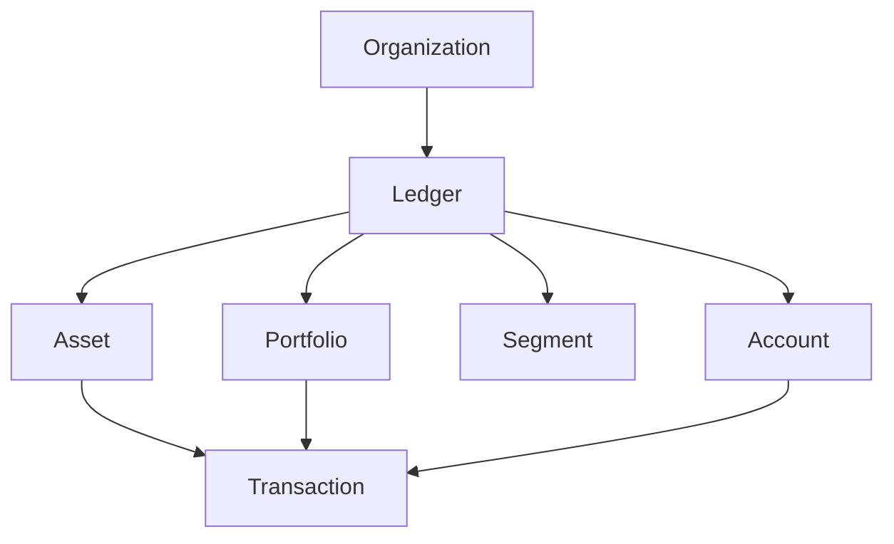

# Midaz Demo Data Generator

A comprehensive, production-ready demo data generator for the Midaz platform with advanced features including validation, circuit breakers, progress reporting, and memory optimization.

## 🚀 Features

### Core Features
- **🎯 Realistic Data Generation**: Creates meaningful demo data with proper relationships
- **🔗 Entity Relationships**: Maintains proper hierarchy (Organizations → Ledgers → Assets/Accounts → Transactions)
- **📊 Multiple Volume Presets**: Small, Medium, Large, and Extra Large configurations
- **🔧 Configurable**: Comprehensive configuration management with environment support

### Advanced Features
- **✅ Data Validation**: Zod schema validation for all entities
- **🔄 Circuit Breaker**: Fault tolerance for API operations
- **📈 Progress Reporting**: Real-time progress with throughput metrics and ETA
- **💾 Memory Optimization**: Efficient state management with configurable limits
- **🔁 Retry Logic**: Exponential backoff retry mechanism
- **📋 Error Tracking**: Comprehensive error reporting and metrics
- **🏗️ Dependency Injection**: Modular architecture with DI container

## 📦 Installation

```bash
# Install dependencies
npm install

# Build the project
npm run build
```

## 🎯 Quick Start

### Basic Usage

```bash
# Generate small dataset (1 org, 2 ledgers, basic entities)
npm run small

# Generate medium dataset (3 orgs, 5 ledgers per org, more entities)
npm run medium

# Generate large dataset (10 orgs, 10 ledgers per org, full scale)
npm run large
```

### Command Line Interface

```bash
# Custom configuration
npm start -- --volume custom --organizations 5 --ledgers-per-org 3

# With specific options
npm start -- --volume small --batch-size 5 --retry-attempts 3

# Development mode with enhanced logging
NODE_ENV=development LOG_LEVEL=debug npm start -- --volume small
```

## 🔧 Configuration

### Environment Variables

```bash
# API Configuration
API_BASE_URL=http://localhost:8080
API_TIMEOUT=30000
MAX_RETRIES=3
RETRY_DELAY=1000

# Features
ENABLE_VALIDATION=true
ENABLE_CIRCUIT_BREAKER=true
ENABLE_PROGRESS_REPORTING=true
MEMORY_OPTIMIZATION=true

# Performance
BATCH_SIZE=10
MAX_ENTITIES_IN_MEMORY=10000

# Logging
LOG_LEVEL=info  # debug, info, warn, error
NODE_ENV=development  # development, production, test
```

### Volume Presets

| Preset | Organizations | Ledgers/Org | Assets/Ledger | Accounts/Ledger | Transactions/Ledger | Total Entities |
|--------|---------------|-------------|---------------|-----------------|-------------------|----------------|
| Small  | 1             | 2           | 3             | 5               | 10                | ~42           |
| Medium | 3             | 5           | 8             | 15              | 50                | ~1,140        |
| Large  | 10            | 10          | 15            | 30              | 200               | ~26,000       |
| XLarge | 25            | 20          | 20            | 50              | 500               | ~287,500      |

## 🏗️ Architecture

### Project Structure

```
src/
├── config/                     # Configuration management
│   └── configuration-manager.ts
├── container/                  # Dependency injection
│   ├── container.ts
│   └── generator-factory.ts
├── generators/                 # Entity generators
│   ├── base.generator.ts      # Abstract base class
│   ├── organizations.ts
│   ├── ledgers.ts
│   ├── assets.ts
│   ├── portfolios.ts
│   ├── segments.ts
│   ├── accounts.ts
│   └── transactions/          # Modular transaction system
│       ├── deposit.generator.ts
│       ├── transfer.generator.ts
│       └── transaction.generator.ts
├── utils/                     # Utilities
│   ├── circuit-breaker.ts    # Fault tolerance
│   ├── progress-reporter.ts  # Real-time progress
│   ├── optimized-state.ts    # Memory-efficient state
│   ├── error-tracker.ts      # Error management
│   └── type-guards.ts        # Type safety
├── validation/               # Data validation
│   ├── schemas.ts           # Zod schemas
│   ├── validator.ts         # Validation utilities
│   └── index.ts
├── services/                # Core services
│   ├── client.ts           # API client
│   └── logger.ts           # Logging service
├── generator.ts             # Main generator class
├── index.ts                 # CLI entry point
└── types.ts                 # Type definitions
```

### Core Components

#### 1. BaseGenerator
Abstract base class providing common functionality:
- Error handling and retries
- Circuit breaker integration
- Progress reporting
- Data validation
- State management

#### 2. Circuit Breaker
Implements the circuit breaker pattern for fault tolerance:
- **CLOSED**: Normal operation
- **OPEN**: Rejects requests after failure threshold
- **HALF_OPEN**: Tests recovery after timeout

#### 3. Progress Reporter
Real-time progress tracking with:
- Throughput metrics (items/second)
- ETA calculation
- Visual progress bar
- Success/failure tracking
- Memory usage monitoring

#### 4. Optimized State Manager
Memory-efficient state management:
- Configurable memory limits
- Automatic cleanup
- Snapshot functionality
- Relationship tracking

## 🧪 Testing

### Running Tests

```bash
# All tests
npm test

# Unit tests only
npm run test:unit

# Integration tests only
npm run test:integration

# With coverage
npm run test:coverage

# Comprehensive test suite
npm run test:comprehensive

# CI/CD mode
npm run test:ci
```

### Test Structure

```
tests/
├── unit/                      # Unit tests
│   ├── validation/
│   ├── utils/
│   └── config/
├── integration/               # Integration tests
│   └── generator-integration.test.ts
├── setup.js                  # Test setup
└── env.setup.js             # Environment setup
```

### Coverage Goals

- **Branches**: 80%
- **Functions**: 80%
- **Lines**: 80%
- **Statements**: 80%

## 📊 Monitoring & Metrics

### Progress Reporting

The system provides real-time feedback during generation:

```
🚀 Starting generation of 100 Organizations
📊 Organization Progress: 45/100 [████████████░░░░░░] 45.0% (✅ 43 ❌ 2) | ⏱️ 12s | 🚀 3.8/s | ETA: 14s
🎯 Organization Generation Complete!
━━━━━━━━━━━━━━━━━━━━━━━━━━━━━━━━━━━━━━━━━━━━
📈 Total Processed: 100/100
✅ Successful: 97
❌ Failed: 3
⏱️ Total Time: 26s
🚀 Average Throughput: 3.85/s
⚡ Average Item Time: 260ms
🎯 Success Rate: 97.0%
```

### Memory Monitoring

```javascript
const memoryStats = stateManager.getMemoryStats();
console.log(`Memory Usage: ${memoryStats.estimatedMemoryMB}MB`);
console.log(`Total Entities: ${memoryStats.totalEntities}`);
```

### Error Tracking

Comprehensive error reporting with context:

```javascript
const errorReport = errorTracker.generateReport();
console.log(`Total Errors: ${errorReport.totalErrors}`);
console.log(`Error Rate: ${errorReport.errorRate}%`);
```

## 🔄 Data Flow

### Generation Process

1. **Configuration Loading**
   - Environment variables
   - Volume presets
   - Feature flags

2. **Initialization**
   - API client setup
   - State manager initialization
   - Circuit breaker configuration

3. **Entity Generation** (in order)
   - Organizations
   - Ledgers (per organization)
   - Assets (per ledger)
   - Portfolios (per ledger)
   - Segments (per ledger)
   - Accounts (per ledger)
   - Transactions (per ledger)

4. **Validation & Persistence**
   - Schema validation
   - API persistence
   - State tracking
   - Error handling

### Entity Relationships



## 🐛 Error Handling

### Error Types

1. **Validation Errors**: Schema validation failures
2. **API Errors**: Network or server issues
3. **Dependency Errors**: Missing required entities
4. **Circuit Breaker Errors**: Service unavailable

### Retry Strategy

- **Exponential Backoff**: 100ms, 200ms, 400ms, 800ms, 1600ms
- **Maximum Retries**: Configurable (default: 3)
- **Circuit Breaker**: Opens after 5 consecutive failures

### Error Recovery

- **Conflict Handling**: Attempts to retrieve existing entities
- **Partial Failures**: Continues generation after individual failures
- **State Consistency**: Maintains entity relationships despite errors

## 🚀 Performance

### Optimizations

1. **Batch Processing**: Configurable batch sizes for API calls
2. **Memory Limits**: Automatic cleanup of old entities
3. **Circuit Breaker**: Prevents cascade failures
4. **Connection Pooling**: Efficient HTTP client usage
5. **Async Operations**: Non-blocking entity generation

### Benchmarks

| Volume | Entities | Time | Throughput | Memory |
|--------|----------|------|------------|---------|
| Small  | ~42      | 8s   | 5.2/s      | 2MB     |
| Medium | ~1,140   | 3m   | 6.3/s      | 15MB    |
| Large  | ~26,000  | 68m  | 6.4/s      | 45MB    |

## 🔒 Security

### Data Privacy
- No sensitive data is logged
- API keys are handled securely
- Generated data is realistic but fake

### Input Validation
- All inputs are validated using Zod schemas
- API responses are type-checked
- Configuration is validated on startup

## 🛠️ Development

### Prerequisites
- Node.js 18+
- TypeScript 5+
- Midaz API access

### Development Workflow

```bash
# Install dependencies
npm install

# Run in development mode
npm run small

# Watch tests
npm run test:watch

# Lint code
npm run lint

# Format code
npm run format

# Build
npm run build
```

### Code Quality

- **ESLint**: Code linting
- **Prettier**: Code formatting
- **TypeScript**: Type safety
- **Jest**: Testing framework
- **Husky**: Git hooks (if configured)

## 📝 API Reference

### Generator Class

```typescript
const generator = new Generator({
  logger: new Logger(),
  apiBaseUrl: 'http://localhost:8080',
  organizations: 5,
  ledgersPerOrg: 3,
  assetsPerLedger: 8,
  // ... other options
});

await generator.generateAll();
```

### Configuration Manager

```typescript
const config = ConfigurationManager.getInstance();
config.setVolumePreset('medium');
const volumeConfig = config.getConfig().volume;
```

### Progress Reporter

```typescript
const reporter = new ProgressReporter('Assets', 100, logger);
reporter.start();
reporter.reportItemCompleted(processingTime);
reporter.stop();
```

## 🤝 Contributing

1. **Fork** the repository
2. **Create** a feature branch (`git checkout -b feature/amazing-feature`)
3. **Commit** your changes (`git commit -m 'Add amazing feature'`)
4. **Push** to the branch (`git push origin feature/amazing-feature`)
5. **Open** a Pull Request

### Guidelines

- Follow TypeScript best practices
- Add tests for new features
- Update documentation
- Ensure all tests pass
- Follow conventional commit format

## 📄 License

This project is licensed under the MIT License - see the [LICENSE](LICENSE) file for details.

## 🆘 Troubleshooting

### Common Issues

**Q: Generation fails with "Circuit breaker is OPEN"**
A: Wait for the recovery timeout or manually reset: `generator.resetCircuit()`

**Q: High memory usage**
A: Reduce `MAX_ENTITIES_IN_MEMORY` or enable `MEMORY_OPTIMIZATION=true`

**Q: Slow generation**
A: Increase `BATCH_SIZE` or reduce entity counts

**Q: Validation errors**
A: Check entity relationships and required fields

### Debug Mode

```bash
NODE_ENV=development LOG_LEVEL=debug npm start -- --volume small
```

### Support

- 📧 Email: support@lerian.studio
- 🐛 Issues: [GitHub Issues](https://github.com/LerianStudio/monorepo/issues)
- 📖 Docs: [Documentation](https://docs.midaz.io)

---

**Built with ❤️ by the Lerian Studio team**