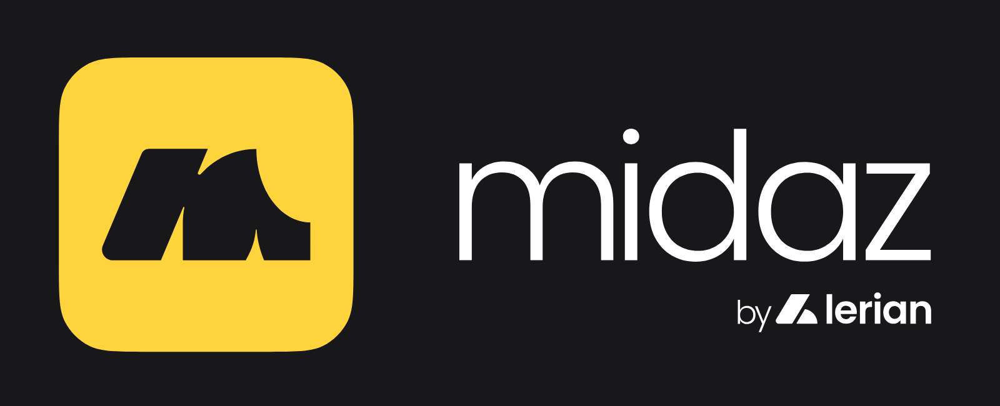

# Midaz Go SDK

The Midaz Go SDK provides a comprehensive client library for interacting with the Midaz financial platform API. This SDK enables Go developers to easily integrate with Midaz's ledger, account, and transaction services.

## Installation

To install the Midaz Go SDK, use `go get`:

```bash
go get github.com/LerianStudio/midaz/sdks/go-sdk
```

## Quick Start

A quick example of how to use different interfaces. This is not a production-ready example, since the flow to create an organization, ledger, account and transactions is not necessarily this way. For real-world use cases, you should see the Example section on [Examples Folder](./examples/README.md).

```go
package main

import (
	"context"
	"fmt"
	"log"

	"github.com/LerianStudio/midaz/sdks/go-sdk/client"
	"github.com/LerianStudio/midaz/sdks/go-sdk/models"
	"github.com/LerianStudio/midaz/sdks/go-sdk/abstractions"
)

func main() {
	// Initialize the client with your authentication token
	c, err := client.New(
		client.WithAuthToken("your-auth-token"),
		client.UseAllAPIs(), // Enable all API interfaces
	)
	if err != nil {
		log.Fatalf("Failed to create client: %v", err)
	}

	// Create a new organization using the builder interface
	org, err := c.Builder.NewOrganization().
		WithName("ACME Corporation").
		Create(context.Background())
	if err != nil {
		log.Fatalf("Failed to create organization: %v", err)
	}
	fmt.Printf("Created organization: %s\n", org.ID)

	// Create a ledger using the entity interface
	ledger, err := c.Entity.Ledgers.CreateLedger(
		context.Background(),
		org.ID,
		&models.CreateLedgerInput{
			Name: "Main Ledger",
		},
	)
	if err != nil {
		log.Fatalf("Failed to create ledger: %v", err)
	}
	fmt.Printf("Created ledger: %s\n", ledger.ID)

	// Create a deposit transaction using the abstraction interface
	tx, err := c.Abstraction.Deposits.Create(
		context.Background(),
		org.ID, ledger.ID,
		"customer:john.doe",
		10000, 2, "USD",
		"Initial deposit",
	)
	if err != nil {
		log.Fatalf("Failed to create deposit: %v", err)
	}
	fmt.Printf("Created deposit transaction: %s\n", tx.ID)
}
```

## Client Configuration

The `client.New()` function creates a new client instance with various configuration options:

```go
c, err := client.New(
	// Authentication
	client.WithAuthToken("your-auth-token"),
	
	// API URLs (optional - defaults to localhost)
	client.WithOnboardingURL("https://api.midaz.io/v1"),
	client.WithTransactionURL("https://api.midaz.io/v1"),
	
	// HTTP client configuration
	client.WithTimeout(30 * time.Second),
	client.WithHTTPClient(customHTTPClient),
	client.WithDebug(true),
	
	// Enable specific API interfaces
	client.UseEntity(),       // Low-level API access
	client.UseBuilder(),      // Fluent builder pattern
	client.UseAbstraction(),  // High-level transaction operations
	// Or enable all interfaces at once
	client.UseAllAPIs(),
)
```

## SDK Structure

The Midaz Go SDK is organized into several packages, each with its own documentation:

### Core Packages

- **Client (`client.go`)**: The main entry point for the SDK, providing access to all API interfaces.
- **[Models](./models/README.md)**: Data structures representing Midaz resources and API inputs/outputs.

### API Interfaces

The SDK offers three different API interfaces, each providing a different level of abstraction:

1. **[Entities](./entities/README.md)**: Low-level API access that closely mirrors the REST API endpoints.
2. **[Builders](./builders/README.md)**: Fluent builder pattern for creating and updating resources.
3. **[Abstractions](./abstractions/README.md)**: High-level transaction operations with simplified interfaces.

### Documentation

- **[API Documentation](./docs/README.md)**: Comprehensive documentation of the SDK's API interfaces.
- **[External APIs](./docs/mapping/external_apis.md)**: Documentation of the public-facing API methods.
- **[Internal APIs](./docs/mapping/internal_apis.md)**: Documentation of the internal implementation details.

## Usage Examples

### Using the Entity Interface

The Entity interface provides direct access to the Midaz API endpoints:

```go
// List accounts in a ledger
accounts, err := c.Entity.Accounts.ListAccounts(
	context.Background(),
	"org-123",
	"ledger-456",
	&models.ListOptions{
		Page: 1,
		PageSize: 10,
		Filter: map[string]string{
			"status": "ACTIVE",
		},
	},
)

// Get an account by ID
account, err := c.Entity.Accounts.GetAccount(
	context.Background(),
	"org-123",
	"ledger-456",
	"account-789",
)
```

### Using the Builder Interface

The Builder interface provides a fluent API for creating and updating resources:

```go
// Create an account
account, err := c.Builder.
	NewAccount().
	WithOrganization("org-123").
	WithLedger("ledger-456").
	WithName("Checking Account").
	WithAssetCode("USD").
	WithType("ASSET").
	Create(context.Background())

// Create a transfer transaction
tx, err := c.Builder.
	NewTransfer().
	WithOrganization("org-123").
	WithLedger("ledger-456").
	WithAmount(2500, 2). // $25.00
	WithAssetCode("USD").
	WithDescription("Transfer between accounts").
	FromAccount("customer:john.doe").
	ToAccount("merchant:acme").
	Execute(context.Background())
```

### Using the Abstraction Interface

The Abstraction interface provides high-level transaction operations:

```go
// Create a deposit
tx, err := c.Abstraction.Deposits.Create(
	context.Background(),
	"org-123", "ledger-456",
	"customer:john.doe",
	10000, 2, "USD",
	"Customer deposit",
	abstractions.WithMetadata(map[string]any{
		"reference": "DEP12345",
	}),
)

// Create a withdrawal
tx, err := c.Abstraction.Withdrawals.Create(
	context.Background(),
	"org-123", "ledger-456",
	"customer:john.doe",
	5000, 2, "USD",
	"Customer withdrawal",
)

// List deposit transactions
deposits, err := c.Abstraction.Deposits.List(
	context.Background(),
	"org-123", "ledger-456",
	&models.ListOptions{
		Limit: 10,
		Filters: map[string]string{
			"status": "completed",
		},
	},
)
```

## Error Handling

The SDK provides consistent error handling across all interfaces:

```go
tx, err := c.Abstraction.Deposits.Create(
	context.Background(),
	"org-123", "ledger-456",
	"customer:john.doe",
	10000, 2, "USD",
	"Customer deposit",
)

if err != nil {
	switch {
	case errors.Is(err, errors.ErrValidation):
		// Handle validation errors
		fmt.Printf("Validation error: %v\n", err)
	case errors.Is(err, errors.ErrAuthentication):
		// Handle authentication errors
		fmt.Printf("Authentication error: %v\n", err)
	case errors.Is(err, errors.ErrPermission):
		// Handle permission errors
		fmt.Printf("Permission error: %v\n", err)
	case errors.Is(err, errors.ErrNotFound):
		// Handle not found errors
		fmt.Printf("Resource not found: %v\n", err)
	default:
		// Handle other errors
		fmt.Printf("Unexpected error: %v\n", err)
	}
}
```

## Best Practices

When working with the Midaz Go SDK:

1. Choose the appropriate interface for your use case:
   - Use the **Entity** interface for direct API access and complex queries
   - Use the **Builder** interface for creating and updating resources with a fluent API
   - Use the **Abstraction** interface for simplified transaction operations

2. Handle errors appropriately using the provided error checking functions

3. Use pagination for listing resources to avoid large response payloads

4. Enable only the API interfaces you need to minimize resource usage

5. Refer to the package-specific documentation for detailed information about each interface

## License

This SDK is licensed under the [LICENSE NAME] license. See the LICENSE file for details.
